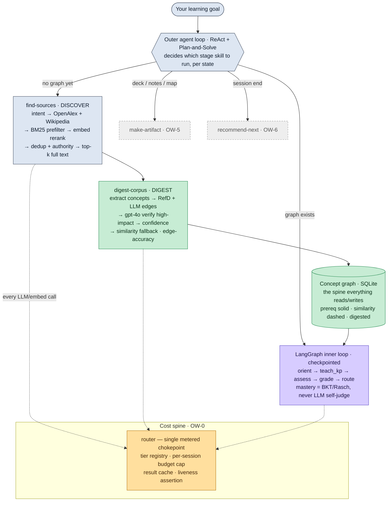

<div align="center">

# 🧭 LitNavigator — Open-World Edition

### Give it any learning goal. It finds the most suitable real sources, digests them into a teachable concept map, and tutors *you* through it — adaptively, grounded in the literature, under strict cost control.

-brightgreen)


</div>

---

## The gap nobody fills

> *You have a question about a research field. Who goes and gets the right papers, turns them into a syllabus, and then teaches it to you — adapting as you stumble?*

| | Models you | Adaptive teach/test/reteach | Prereq sequencing | From living literature | **Finds its own sources** | Curriculum source |
|:--|:--:|:--:|:--:|:--:|:--:|:--|
| Elicit / SciSpace | ✗ | ✗ | ✗ | ✓ | ✓ | — |
| NotebookLM | ✗ | ✗ | ✗ | ✓ (you upload) | ✗ | — |
| Khanmigo / LearnLM | ✓ | ✓ | ✓ | ✗ | ✗ | human-authored |
| **LitNavigator (open-world)** | ✓ | ✓ | ✓ | ✓ | ✓ | **discovered + digested live** |

The closed-world edition (M0–M3) tutored from a *curated* paper pack. The **open-world** edition removes the boundary: it **discovers** sources for any goal and **digests** them into the concept graph on demand.

---

## How it works



**Stage skills** the outer loop invokes (each contracted, metered, live-verified):

| Stage | Status | What it does |
|:--|:--:|:--|
| **find-sources** (DISCOVER) | ✅ live | goal + intent → real OpenAlex/Wikipedia sources, ranked by relevance × authority, top-k full text fetched |
| **digest-corpus** (DIGEST) | ✅ live | sources → distinct concepts → prerequisite (RefD **+** LLM) and similarity edges → `gpt-4o` verify → grounded, cited graph |
| **teach / assess** (inner loop) | ✅ live | per-keypoint adaptive teaching; goal-elicited Bloom ceiling; metered grade with frontier escalation near the mastery threshold; MCQ distractors + flaw gate + IRT difficulty; FSRS spacing + retention probe; mastery from answers (BKT/Rasch), never LLM self-judgment |
| **make-artifact** | ⏳ OW-5 | mind-map / notes / slides / worked-example, format chosen per scenario |
| **recommend-next** | ⏳ OW-6 | hard-prereq filter + soft mastery-gain ranker |

---

## Live-first — the validation principle

Open-world capability is meaningless if only tested offline. So **every capability skill has a LIVE gate** that runs against a real provider and asserts structure + quality + **real metered cost**; offline gates are kept only for deterministic safety/math. A strict mode makes a real call *provably distinct* from a silent fallback (a dead provider raises, never quietly returns a fixture).

What this caught and fixed, on real runs:
- the digest's `frontier` tier was silently calling `gpt-4o-mini` (billed at gpt-4o rates) — **tier routing fixed**, the judge now runs on real `gpt-4o`;
- a chunk-id format bug dropped **100%** of proposed edges — fixed; edges now build;
- the cheap model self-judging gave false confidence — the real `gpt-4o` judge corrects it; and a non-LLM **RefD** signal recovers genuine prerequisites the judge alone rejects.

A full digest (discover → 8 concepts → RefD+LLM edges → gpt-4o judge) costs **≈ $0.003**. Offline, everything runs at **$0**.

---

## Quick start

```bash
pip install -r requirements.txt

# Offline gates (deterministic, $0, no key, no network)
python -m litnav.evaluation.verify_cost      # cost spine: metering + budget cap + record-only refusal
python -m litnav.evaluation.verify_digest    # digest determinism/schema unit gate
python -m litnav.evaluation.verify_discover  # find-sources parsing/rank/dedup/intent
python -m litnav.evaluation.verify_m0        # legacy closed-world gates (still green)
pytest -q                                    # full suite — 231 passed

# LIVE gates (real provider; set LITNAV_LLM_PROVIDER=openai + LITNAV_LLM_API_KEY in .env)
python -m litnav.evaluation.verify_liveness      # a real call is distinguishable from a fallback
python -m litnav.evaluation.verify_cost_live     # budget cap fires on real spend
python -m litnav.evaluation.verify_digest_live   # real LLM extracts + builds + judges a graph
python -m litnav.evaluation.verify_discover_live # real OpenAlex/Wikipedia/arXiv discovery → digest
```

> Offline is the deterministic floor; the LIVE gates are the proof the capability works. See
> [`docs/2026-06-20-live-gate-execution-contract.md`](docs/2026-06-20-live-gate-execution-contract.md) for how they run (provider, budget cap, liveness, outage policy).

### Interactive agent UI (closed-world tutor)
```bash
python -m litnav.ui.server     # http://127.0.0.1:8000/tutor — Chat + Glass-box views
```

---

## Roadmap (open-world milestones)

| Milestone | Status | Proof |
|:--|:--:|:--|
| **Phase 0** · LLM liveness precondition | ✅ done · live | `verify_liveness` |
| **OW-0** · Cost spine (registry · metered router · budget cap · result cache) | ✅ done · live | `verify_cost_live` |
| **OW-1** · Data model (concept-graph + learner + cache + ledger schema) | ✅ done | schema + repo tests |
| **OW-2** · digest-corpus (RefD+LLM edges, gpt-4o verify, cache) | ✅ done · live | `verify_digest_live` |
| **OW-3** · find-sources (OpenAlex+Wikipedia, BM25+rerank, full text) | ✅ done · live | `verify_discover_live` |
| **OW-4** · TEACH/ASSESS (goal elicitation, Bloom quiz, distractors, IRT, FSRS, retention probe, escalation) | ✅ done · live | `verify_teach_assess_live` |
| **OW-5** · make-artifact (map/notes/slides/worked-example) | ⏳ next | — |
| **OW-6** · recommend-next + dual frontend (Glass-box on `cost_ledger`, teacher override) | ⏳ pending | — |
| **OW-7** · live cold-start (streamed real-topic digest→teach) | ⏳ pending (digest path already live) | — |

Full per-module detail, live results, costs, and the deferred/flagged items: **[`docs/OPEN-WORLD-STATUS.md`](docs/OPEN-WORLD-STATUS.md)**.

---

## Design principles
- **Grounded, not bluffing.** Open-domain ≠ ungrounded — it *fetches and digests* a source, then teaches from cited evidence.
- **The learner model is BKT/Rasch, never LLM self-assessment.**
- **Cost is a first-class constraint** — one metered chokepoint, a tier cascade, caching, a per-session budget cap; only approved models are callable, any other is record-only until approved.
- **Prereq edges are a soft constraint** (RefD + LLM + similarity fallback), never a hard gate; confidence is rule-computed and surfaced, never hallucinated.
- **No silent deviations.** Code is kept on one line with the research and the full spec; anything deferred is flagged in the spec.

---

## Tech stack
`LangGraph` (inner loop) · ReAct outer loop · `SQLite` (concept graph · learner model · cost ledger · caches) · OpenAI `gpt-4o-mini` (cheap) + `gpt-4o` (frontier judge) + `text-embedding-3-small` — provider-agnostic, offline-capable · OpenAlex / Wikipedia / arXiv (live discovery) · RefD (Liang 2015) prerequisite signal · `pytest`

## Documentation
| Doc | Role |
|:--|:--|
| [`docs/2026-06-20-open-world-research-brief.md`](docs/2026-06-20-open-world-research-brief.md) | research questions + rationale |
| [`docs/2026-06-20-open-world-literature-review.md`](docs/2026-06-20-open-world-literature-review.md) | verified literature + evidence grades + risks |
| [`docs/2026-06-20-open-world-architecture-spec.md`](docs/2026-06-20-open-world-architecture-spec.md) | **full architecture spec (source of truth)** |
| [`docs/OPEN-WORLD-STATUS.md`](docs/OPEN-WORLD-STATUS.md) | **per-module status / done / live results** |
| `docs/superpowers/plans/` | per-milestone implementation plans |
| `docs/archive/` | per-cycle eval log, audits, re-audit; `closed-world/` = legacy M0–M4 docs |

---

## Acknowledgments
Built for the **ICCSE 2026 Agentic AI Competition** (NTU · Tsinghua · Shandong · Xinjiang · UBC · Alibaba). Compute supported by QoderWork and Alibaba Cloud "Cloud for Research." **License:** MIT — see [LICENSE](LICENSE).
