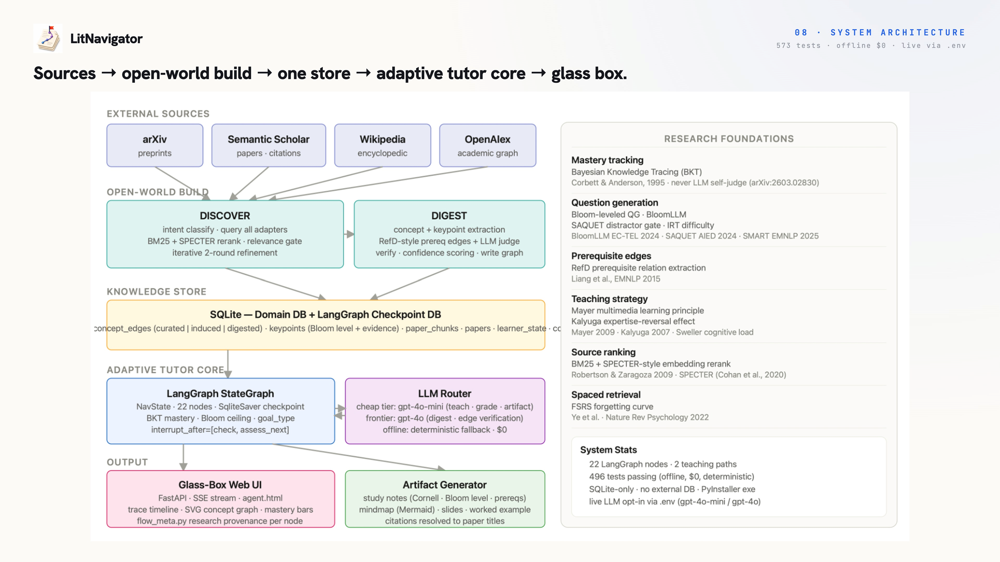
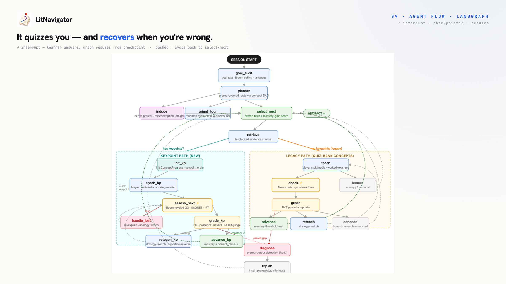

<div align="center">

# 🧭 LitNavigator

### Reads the literature. Builds the course. Shows its work.

Give it **any learning goal, in any language.** LitNavigator finds real papers, induces a
**prerequisite-ordered concept map**, and tutors *you* through it — adaptively, with **every claim
cited and every number rule-computed.** An open-world agentic study copilot.


-2D6CDF)


**[▶ Download &amp; run](https://github.com/The-Architect-3906/LitNavigator/releases/latest)** · [Architecture](#architecture) · [How to run](#how-to-run) · [What it does](#what-it-does) · [Results](#results)

</div>

---

## What it is

A researcher or student entering a new field faces a wall: **find the right papers → figure out what
to read first → read passively → hope it sticks.** Search tools find papers but don't teach. Tutors
teach, but only fixed, human-authored curricula — never the live literature. Generic chatbots bluff.

**LitNavigator closes that gap.** Type a goal; it *discovers* real sources, *digests* them into a
cited, prerequisite-ordered concept map, then *teaches and quizzes* you through it — adapting when you
struggle, conceding honestly when a concept won't land, and showing its work the whole way. It runs
**fully offline at $0**, or **live for ~$0.02 a session** with any provider's key.

| | Finds its own sources | From living literature | Prereq sequencing | Adaptive teach / test / reteach | Honest, cited |
|:--|:--:|:--:|:--:|:--:|:--:|
| Elicit / SciSpace | ✓ | ✓ | ✗ | ✗ | ✓ |
| NotebookLM | ✗ | ✓ (you upload) | ✗ | ✗ | ✓ |
| Khanmigo / LearnLM | ✗ | ✗ | ✓ | ✓ | ✓ |
| **LitNavigator** | **✓** | **✓** | **✓** | **✓** | **✓** |

---

## Architecture

**Five layers** — external sources → open-world build → one SQLite store → an adaptive tutor core →
the glass-box UI — all behind one metered, provider-agnostic router.



**The agent loop.** Teaching runs on a checkpointed **LangGraph** state machine: it plans a route over
the concept map, teaches each concept keypoint-by-keypoint, quizzes at rising Bloom levels, and
**recovers when you're wrong** — reteaching with a new strategy, re-explaining on "I'm lost",
detouring to a missing prerequisite, or conceding honestly. Mastery is computed by rule (BKT), never
by the model grading itself.



---

## How to run

### Option A — Download the app (Windows, no setup)

1. Download **`LitNavigator-windows.zip`** from the **[latest release](https://github.com/The-Architect-3906/LitNavigator/releases/latest)** and unzip.
2. Run **`LitNavigator.exe`** → it starts a local server and opens `http://127.0.0.1:8000/tutor`.
3. **Offline by default** ($0, no key): the full agentic flow on a curated agent-papers corpus.
4. **Enable live open-world** — discover + digest real papers for *any* goal — by dropping a **`.env`**
   next to the exe (a `.env.example` is included):

   ```dotenv
   LITNAV_LLM_PROVIDER=openai
   LITNAV_LLM_API_KEY=sk-...
   ```

   Provider-agnostic via **LiteLLM** — OpenAI · Anthropic · Gemini · DeepSeek · Groq · local /
   any OpenAI-compatible endpoint. A live session costs about **$0.02**. After launch, the exe writes a
   **`litnav_startup.log`** next to it showing whether live mode engaged (`provider`, `mode`).

### Option B — Run from source (any OS)

```bash
pip install -r requirements.txt
python -m litnav.ui.server      # → http://127.0.0.1:8000/tutor
```

Offline by default ($0). For live mode, create a `.env` in the project root with the keys above.

---

## What it does

Five contracted skills, orchestrated by a ReAct + Plan-and-Solve loop over one concept graph and one
metered router:

| Skill | What it does |
|:--|:--|
| **find-sources** | Goal → query (any language → English) → searches **OpenAlex · Semantic Scholar · arXiv · Wikipedia** → ranks by relevance × authority → drops off-topic sources → fetches full text |
| **digest-corpus** | Reads the sources → extracts concepts + keypoints → builds **prerequisite (RefD + LLM)** and similarity edges → frontier-model verify → a cited concept graph |
| **teach / assess** | Teaches keypoint-by-keypoint, quizzes at rising **Bloom** levels, and adapts — reteach / re-explain / prerequisite-detour / honest concede. Mastery is **BKT-computed**, never the model judging itself |
| **make-artifact** | A downloadable take-away — **Cornell notes · mind-map · slides · worked-example** — in the learner's language, every claim cited |
| **recommend-next** | Prerequisite-aware ranking of the best concept to learn next |

Everything is a **glass box**: the UI shows, per step, which skill ran, which method, and which paper —
plus live mastery bars and a running cost meter.

---

## Results

From a 10-scenario live end-to-end evaluation (frontier-model judge) plus the automated suite:

| | |
|:--|:--|
| **4.33 / 5** | overall teaching quality across 10 live scenarios (8 / 9 ≥ 4) |
| **4.78 / 5** | grounding — cited chunks resolve to real source papers |
| **≈ $0.02** | per full multi-concept live session · **$0** fully offline |
| **4 / 4** | languages taught (en · 中 · es · fr) |
| **573** | automated tests — 557 offline ($0) + 16 live-gated |
| **all fire live** | adaptive branches: advance · reteach→recover · concede · lost→recover |

**Honest limits** (stated plainly): source precision can still admit an adjacent-but-wrong paper on
niche goals; non-English *quizzes* can revert to English; spaced review is built but not yet delivered
before new teaching; digest is single-source per topic today. See
[`docs/E2E-REPORT.md`](docs/E2E-REPORT.md) for the full breakdown.

---

## Tech stack

`LangGraph` (checkpointed inner loop) · ReAct + Plan-and-Solve outer loop · `SQLite` (concept graph ·
learner model · cost ledger) · **LiteLLM** gateway — any provider, default `gpt-4o-mini` (cheap) +
`gpt-4o` (frontier) + `text-embedding-3-small`, offline-capable ($0) · OpenAlex / Semantic Scholar /
arXiv / Wikipedia discovery · RefD (Liang 2015) prerequisite signal · FastAPI + SSE UI · PyInstaller
desktop build.

## Documentation

Deep technical detail lives in [`docs/`](docs): research &amp; architecture spec
([`RESEARCH-AND-SPEC.md`](docs/RESEARCH-AND-SPEC.md)), the backend and frontend references
([`BACKEND-COMPLETE.md`](docs/BACKEND-COMPLETE.md) · [`FRONTEND-COMPLETE.md`](docs/FRONTEND-COMPLETE.md)),
their roadmaps, and the end-to-end evaluation ([`E2E-REPORT.md`](docs/E2E-REPORT.md)).

## Team &amp; license

**Team The Three Musketeers** — **Tu Yaowei** (agent &amp; backend) · **Jing Yen** (research, eval &amp; UX),
National University of Singapore. Built for the **ICCSE 2026 Agentic AI Competition**. Compute
supported by QoderWork and Alibaba Cloud "Cloud for Research." **License:** MIT — see [LICENSE](LICENSE).
