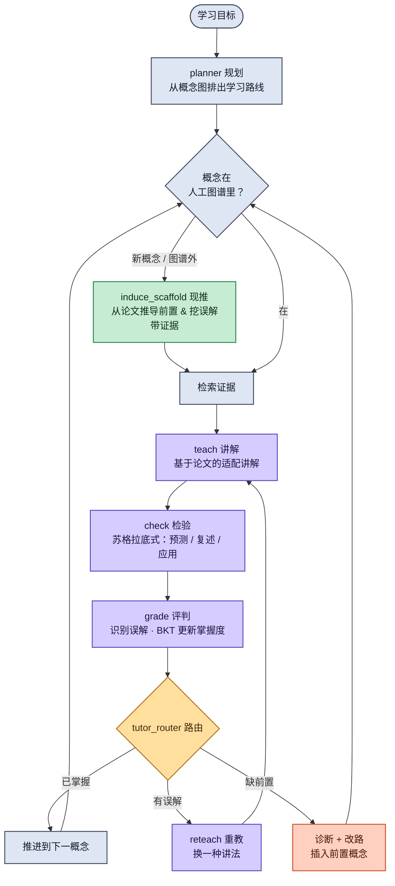

<div align="center">

# 🧭 LitNavigator

**一个直接从论文里教你入门陌生研究领域的 AI 导师。**

*它不丢给你一份阅读清单，而是亲自讲解概念、检验你真正学懂了多少、没懂就换种讲法重教、缺前置就回退补课——而这套课程脚手架，是从活的研究文献里自己长出来的。*

[English](README.md) · **简体中文**


</div>

---

## 这是什么？

进入一个陌生的研究子领域是件苦差事：没有教学大纲，只有成百上千篇互相预设背景、又暗暗矛盾的论文。现有工具解决不了这件事——它们要么**帮你找论文**（Elicit、Connected Papers），要么**回答你上传论文的问题**（NotebookLM）。没有一个真正在*教*你，也没有一个知道*你*已经懂了什么。

**LitNavigator 是一个以活的研究文献为教材的有状态导师。** 给它一个子领域和一个学习目标，它会：

- 📖 **教**：直接把每个概念讲给你——基于真实论文、带引用——而不是让你"自己去读这篇"。
- ❓ **测**：用苏格拉底式提问检验你的理解，并定位你**具体的误解**。
- 🔁 **换讲法重教**：你没懂，它换一个类比、一个具体例子重讲，而不是把同一套复读一遍。
- ⛏️ **回退补课**：当测验暴露出你缺某个前置时，它把前置插进你的学习路线。
- 🌐 **从语料里自己推导课程**：它直接从论文中*推导*前置依赖关系、*挖出*这个领域常见的误区，每一项都附可点开的引用证据。

它**不训练任何模型**：智能来自检索、一张概念/误解图、从文献现推的脚手架，以及运行时的状态转移。

---

## 🎬 演示

<!-- TODO: 在这里放一段 30–60 秒的 GIF → docs/demo.gif -->
<div align="center">

</div>

重点看三件事：

1. **"我换个角度再讲一遍。"** 你暴露出对*稠密检索（dense retrieval）*的误解（以为它就是关键词匹配）。LitNavigator 切换到"嵌入空间近邻"的类比重讲——你的掌握度从 `0.40` 跳到 `0.81`。
2. **"你得先回去补一节课。"** 一道关于*对比学习*的题暴露出你没掌握*负样本采样（negative sampling）*。LitNavigator 在继续之前插入一节前置，你的学习路线当场改变。
3. **"这个概念不在你的图谱里——让我从论文里把它理出来。"** 你问起*难负样本挖掘（hard-negative mining）*。LitNavigator 读语料、推导出它建立在负样本采样之上、挖出论文自己点明的一个误区，并把它当作*尚有争议*的内容来教——全部带可点开的证据。

---

## 🆚 为什么不用现有工具？

| | 建模*你* | 自适应教/测/重教 | 前置排序 | 误解诊断 | 内容来自活文献 | 课程来源 |
|---|:---:|:---:|:---:|:---:|:---:|:---:|
| **Elicit / SciSpace** | ✗ | ✗ | ✗ | ✗ | ✓ | — |
| **NotebookLM** | ✗ | ✗ | ✗ | ✗ | ✓（你上传的） | — |
| **Khanmigo / LearnLM** | ✓ | ✓ | ✓ | ✓ | ✗（固定课程） | 人工授权课程 |
| **LitNavigator** | ✓ | ✓ | ✓ | ✓ | ✓ | **人工策展 + 从论文现推** |

最后一列就是没人填上的空格：一个自适应导师，它的**前置、误解和讲解内容都源自开放的研究前沿**——这恰恰是研究者进入一个新领域时面对的真实处境。

---

## 🧠 工作原理

LitNavigator 是一个**双嵌套循环**：外层的*课程*循环决定接下来学什么，内层的*授课*循环把一个概念真正教到你懂为止。一条旁路让它能在需要时**从语料里现推缺失的脚手架**。



- **外层循环** —— `planner → 选概念 → … → 推进 / 改路`：决定接下来学什么；遇到前置缺口就插入缺失概念。
- **内层循环** —— `teach → check → grade → reteach`：教一个概念，检测到误解时换一种*不同的*讲法重教。
- **`induce_scaffold`** —— 当你走到图谱外，它**从论文里**推导前置结构和领域已知的坑，每一项都标注为"机器现推"并附引用证据。

每一个决策都带一条可追溯的理由：从*你的*测验结果 → 对应概念/误解 → 采取的动作。没有黑箱。

---

## ✨ 核心特性

- **真正被用上的状态。** 一个逐概念的掌握度 + 误解模型（轻量贝叶斯知识追踪 BKT）驱动每一次教学决策——不是无状态的 chatbot。
- **有据可依，绝不幻觉。** 讲解引用真实片段；现推的前置和误解都附带它们被推导出来的确切段落。
- **诚实地教前沿。** 概念被标记为*共识 / 争议 / 开放*，置信度经过校准——它会告诉你这个领域哪里还没定论。
- **可审计。** 学习路线的变化、重教策略、现推的脚手架，全部被记录、可检视。

---

## 🚀 快速开始

> 需要 Python 3.11+ 和一个 LLM API key（系统与模型无关；我们用 Qwen）。

```bash
git clone https://github.com/<your-org>/litnavigator.git
cd litnavigator
pip install -r requirements.txt

cp .env.example .env          # 填入你的 LLM API key

# 构建离线语料、概念图、题库与误解库
python -m litnav.ingest --topic "RAG for scientific QA"

# 启动导师
python -m litnav.app
```

构建步骤在**离线**完成（论文、向量、概念/前置图），因此运行时的会话不依赖任何外部 API。

---

## 🗂️ 项目结构

```
litnavigator/
├── litnav/
│   ├── graph/          # LangGraph 状态机：节点 + 条件边
│   ├── nodes/          # planner, teach, check, grade, reteach, induce_scaffold, replan
│   ├── retrieval/      # FTS5(BM25) + Chroma 向量检索
│   ├── scaffold/       # 前置推导 + 误解挖掘
│   ├── state.py        # NavState / 学习者模型
│   └── app.py          # 入口 / UI
├── data/               # SQLite（图 + 状态）+ Chroma 索引
├── docs/               # 演示素材、架构说明
└── README.md
```

---

## 🗺️ 路线图

我们按**风险阶梯**开发——每个里程碑都是一个完整、可演示的系统，因此任何时刻都有一个能交付的可用版本。

- [ ] **M0 · 走通骨架** —— 端到端状态机 + 离线语料
- [ ] **M1 · Navigator** —— 自适应学习路线；遇前置缺口自动改路 *（亮点 ①）*
- [ ] **M2 · Tutor** —— 基于论文的讲解 + 误解驱动的换讲法重教 *（亮点 ②）*
- [ ] **M3 · 文献现推脚手架** —— 从语料推导前置 & 挖掘误解 *（亮点 ③ —— 真正的差异化）*
- [ ] **M4 · 打磨** —— 决策追溯 UI、覆盖度提示、混合检索、跨会话记忆

> **当前里程碑：** `M_` —— _随进度更新。_

---

## 📚 学习科学依据

设计不是拍脑袋，每一处都对应已确立的研究：

- **Bloom 2-sigma 问题** —— 一对一辅导 + 掌握学习；我们把它带到研究前沿。
- **贝叶斯知识追踪（BKT）** —— 逐概念的掌握度模型。
- **检索练习 & ICAP 框架** —— 测验本身就是一种*学习*机制，并促使你预测/复述/应用，而非被动阅读。
- **形成性评价 & 脚手架** —— 先诊断、再换讲法重教；随掌握度提升逐步撤去支持。

---

## 🛡️ 负责任的 AI

- 讲解基于真实段落；**引用绝不编造**——这对一个文献工具是不可妥协的底线。
- **现推**的脚手架始终标注为机器推导，附证据与置信度，且可被用户推翻。
- 不确定性经过**校准**：争议与开放问题如实呈现为争议与开放。
- 测验是**形成性的**，非高利害——它存在的意义是帮你学，而不是给你打分。

---

## 🧰 技术栈

`LangGraph` · `SQLite`（+ FTS5/BM25） · `Chroma` · `bge-m3` 向量 · `networkx` · Qwen（与模型无关）

---

## 🙏 致谢

为 **ICCSE 2026 Agentic AI Competition**（第九届群智科学与工程国际会议）而构建，由南洋理工大学、清华大学、山东大学、新疆大学、英属哥伦比亚大学与阿里巴巴共同主办。原型开发由 QoderWork 与阿里云"云工开物"算力支持。

## 📄 许可证

MIT —— 见 [LICENSE](LICENSE)。
