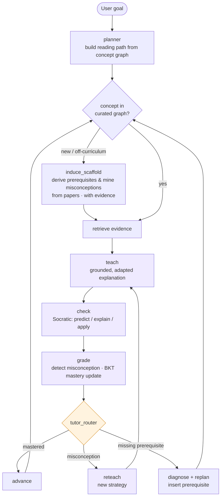

<div align="center">

# 🧭 LitNavigator

**An AI tutor that teaches you a new research field — straight from the papers.**

*It doesn't hand you a reading list. It teaches the concepts, checks what you actually understood, re-explains when you don't get it, and backs you up when you're missing a prerequisite — building the curriculum from the live literature itself.*


</div>

---

## What is this?

Entering a new research subfield is brutal: there's no syllabus, just hundreds of papers that assume each other's background and quietly contradict one another. Existing tools don't fix this — they either **find papers for you** (Elicit, Connected Papers) or **answer questions about papers you upload** (NotebookLM). None of them *teach* you, and none of them know what *you* already understand.

**LitNavigator is a stateful tutor whose textbook is the living research literature.** Give it a subfield and a goal, and it:

- 📖 **Teaches** each concept directly — grounded in real papers, with citations — instead of telling you to "go read this."
- ❓ **Checks** your understanding with Socratic questions, and pinpoints your *specific* misconception.
- 🔁 **Re-teaches differently** when you don't get it — a new analogy, a worked example — rather than repeating itself.
- ⛏️ **Backs you up** when a quiz reveals you're missing a prerequisite, and inserts it into your path.
- 🌐 **Derives the curriculum from the corpus itself** — it *induces* prerequisite relationships and *mines* a field's common misconceptions straight from the papers, every claim backed by citable evidence.

It trains **no models**. Its intelligence comes from retrieval, a concept/misconception graph, literature-derived scaffolding, and runtime state transitions.

---

## 🎬 Demo

<!-- TODO: drop a 30–60s GIF here → docs/demo.gif -->
<div align="center">

</div>

Three things to watch for:

1. **"Let me explain that differently."** You reveal a misconception about *dense retrieval* (you think it's keyword matching). LitNavigator switches to an embedding-space analogy and re-teaches — your mastery jumps `0.40 → 0.81`.
2. **"You'll want to back up first."** A quiz on *contrastive learning* shows you don't have *negative sampling* down. LitNavigator inserts a primer before continuing, and your reading path visibly changes.
3. **"This concept isn't in your map — let me work it out from the papers."** You ask about *hard-negative mining*. LitNavigator reads the corpus, derives that it builds on negative sampling, surfaces a misconception the papers themselves flag, and teaches it as *still-contested* — all with evidence you can click.

---

## 🆚 Why not just use…?

| | Models *you* | Adaptive teach / re-teach | Prerequisite ordering | Misconception diagnosis | Content from live literature | Curriculum source |
|---|:---:|:---:|:---:|:---:|:---:|:---:|
| **Elicit / SciSpace** | ✗ | ✗ | ✗ | ✗ | ✓ | — |
| **NotebookLM** | ✗ | ✗ | ✗ | ✗ | ✓ (your uploads) | — |
| **Khanmigo / LearnLM** | ✓ | ✓ | ✓ | ✓ | ✗ (fixed course) | authored curriculum |
| **LitNavigator** | ✓ | ✓ | ✓ | ✓ | ✓ | **curated + induced from papers** |

The last column is the gap nobody fills: an adaptive tutor whose **prerequisites, misconceptions, and teaching material are derived from the open research frontier** — exactly the situation a researcher faces when entering a new area.

---

## 🧠 How it works

LitNavigator is a **double-nested loop**: an outer *curriculum* loop that decides what to study next, and an inner *tutoring* loop that actually teaches one concept until you've got it. A side path lets it **induce missing scaffolding from the corpus** on demand.



- **Outer loop** — `planner → select → … → advance / replan`: picks what to study next; on a prerequisite gap, it inserts the missing concept.
- **Inner loop** — `teach → check → grade → reteach`: teaches one concept and re-teaches with a *different* strategy when a misconception is detected.
- **`induce_scaffold`** — when you go off-map, it derives the prerequisite structure and the field's known pitfalls **from the papers**, tagging every item as machine-induced with its citing evidence.

Every decision is logged with a rationale that traces back to *your* quiz result → the concept/misconception → the action taken. Nothing is a black box.

---

## ✨ Key features

- **State that's actually used.** A per-concept mastery + misconception model (a lightweight Bayesian Knowledge Tracing) drives every teaching decision — not a stateless chatbot.
- **Grounded, never hallucinated.** Explanations cite real chunks; induced prerequisites and misconceptions come with the exact passages they were derived from.
- **Teaches the frontier honestly.** Concepts are flagged *consensus / contested / open*, and confidence is calibrated — it tells you where the field hasn't settled.
- **Auditable.** Reading-path changes, re-teach strategies, and induced scaffolding are all recorded and inspectable.

---

## 🚀 Quickstart

> Requires Python 3.11+ and an LLM API key (the system is model-agnostic; we use Qwen).

```bash
git clone https://github.com/<your-org>/litnavigator.git
cd litnavigator
pip install -r requirements.txt

cp .env.example .env          # add your LLM API key

# Build the offline corpus, concept graph, and quiz/misconception banks
python -m litnav.ingest --topic "RAG for scientific QA"

# Launch the tutor
python -m litnav.app
```

The ingest step runs **offline** (papers, embeddings, concept/prerequisite graph) so a live session never depends on external APIs.

---

## 🗂️ Project structure

```
litnavigator/
├── litnav/
│   ├── graph/          # LangGraph state machine: nodes + conditional edges
│   ├── nodes/          # planner, teach, check, grade, reteach, induce_scaffold, replan
│   ├── retrieval/      # FTS5 (BM25) + Chroma vector search
│   ├── scaffold/       # prerequisite induction + misconception mining
│   ├── state.py        # NavState / learner model
│   └── app.py          # entrypoint / UI
├── data/               # SQLite (graph + state) + Chroma index
├── docs/               # demo assets, architecture notes
└── README.md
```

---

## 🗺️ Roadmap

We build as a **risk ladder** — each milestone is a complete, demoable system, so there's always a working version to ship.

- [ ] **M0 · Walking skeleton** — end-to-end state machine + offline corpus
- [ ] **M1 · Navigator** — adaptive reading path; reroutes on prerequisite gaps *(money shot ①)*
- [ ] **M2 · Tutor** — grounded teaching + misconception-driven re-teaching *(money shot ②)*
- [ ] **M3 · Literature-derived scaffolding** — induce prerequisites & mine misconceptions from the corpus *(money shot ③ — the differentiator)*
- [ ] **M4 · Polish** — decision tracing UI, coverage warnings, hybrid retrieval, cross-session memory

> **Current milestone:** `M_` — _update as you go._

---

## 📚 Grounded in learning science

The design isn't ad hoc. Each piece maps to established work:

- **Bloom's 2-sigma problem** — one-to-one tutoring + mastery learning; we bring it to the research frontier.
- **Bayesian Knowledge Tracing** — the per-concept mastery model.
- **Retrieval practice & the ICAP framework** — quizzes are a *learning* mechanism, and we push you to predict/explain/apply rather than read passively.
- **Formative assessment & scaffolding** — diagnose, then re-teach differently; fade support as mastery grows.

---

## 🛡️ Responsible AI

- Explanations are grounded in real passages; **citations are never fabricated** — a non-negotiable for a literature tool.
- **Induced** scaffolding is always labeled as machine-derived, shown with its evidence and a confidence level, and can be overridden.
- Uncertainty is **calibrated**: contested and open questions are presented as such.
- Quizzes are **formative**, not high-stakes — they exist to help you learn, not to grade you.

---

## 🧰 Tech stack

`LangGraph` · `SQLite` (+ FTS5/BM25) · `Chroma` · `bge-m3` embeddings · `networkx` · Qwen (model-agnostic)

---

## 🙏 Acknowledgements

Built for the **ICCSE 2026 Agentic AI Competition** (The 9th International Conference on Crowd Science and Engineering), co-hosted by NTU, Tsinghua, Shandong University, Xinjiang University, UBC, and Alibaba. Prototype development supported by QoderWork and Aliyun 云工开物 compute credits.

## 📄 License

MIT — see [LICENSE](LICENSE).
