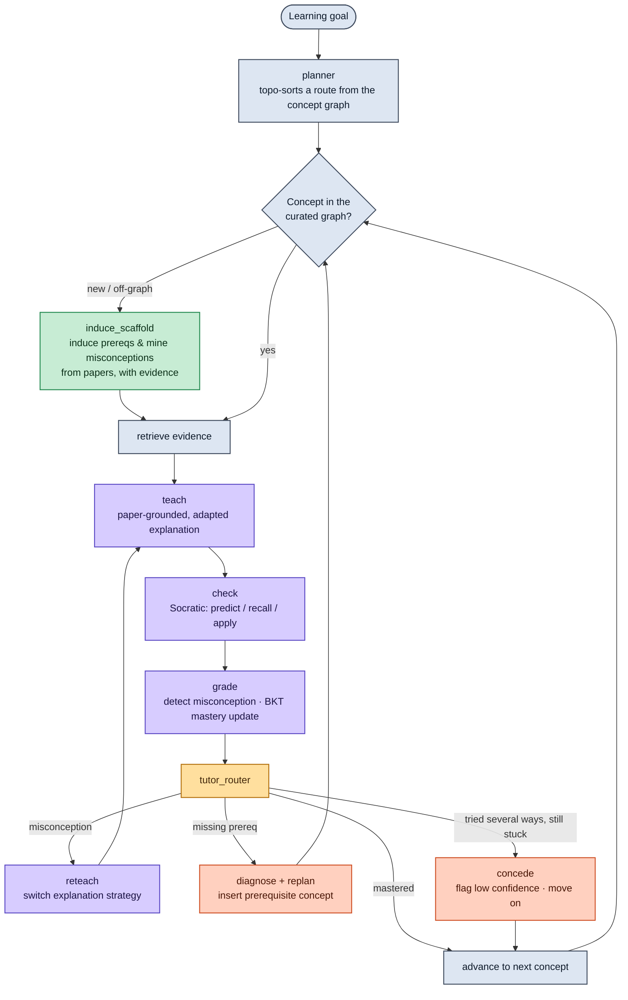

<div align="center">

# 🧭 LitNavigator

**An AI tutor that starts from the papers and walks you, step by step, into an unfamiliar research field.**

*It won't hand you a stack of papers and a reading list. It actually explains the concepts: it teaches, then quizzes you; when a question trips you up it re-explains a different way; when it finds you're missing a prerequisite it teaches that first. And that "syllabus" itself is something it works out on its own from a pile of living papers.*


</div>

---

## Current status

This repository is currently in the **planning and architecture stage**. It contains the product narrative, full build spec, and static architecture page, but the runnable Python package has not been implemented yet.

What is present now:

- `litnavigator-build-spec.md` — complete product/architecture/milestone spec.
- `litnavigator.html` — static architecture and positioning page.
- `docs/architecture.md` — system boundaries, state machine, and data flow.
- `docs/milestones.md` — M0-M4 gates and timeline checkpoints.
- `docs/evaluation.md` — T1-T11 acceptance checks and gate commands.
- `docs/demo-script.md` — competition demo path and fallback recordings.
- `docs/data-contract.md` — SQLite tables, seed fixture shape, and state contracts.
- `docs/development-architecture.md` — engineering skeleton and module boundaries.
- `docs/engineering-slices.md` — phased build slices from planning to M4.
- `docs/m0-walking-skeleton.md` — detailed M0 definition of done.
- `docs/superpowers/plans/2026-06-16-complete-engineering-plan.md` — complete M0-M4 engineering implementation plan.
- `docs/superpowers/plans/2026-06-16-m0-walking-skeleton.md` — detailed implementation plan for the first runnable slice.

What is not present yet:

- `litnav/` Python package.
- `requirements.txt`.
- `.env.example`.
- seed data / SQLite runtime data.
- tests and verification scripts.

The next engineering step is **M0: fake-data walking skeleton**. M0 should prove the state machine and persistence loop before adding ingestion, embeddings, full retrieval, or a polished UI.

## What this is

The hardest part of breaking into an unfamiliar research subfield is never a lack of material — it's that there's too much of it and no one to untangle it for you: hundreds of papers each presupposing some background, and every so often contradicting one another. Today's tools don't help with this. They either retrieve papers for you (Elicit, Connected Papers) or answer questions about papers you upload (NotebookLM). None of them teach you, and none of them know what you actually already understand.

**LitNavigator is a stateful AI tutor that treats the living research literature as its textbook.** You give it a field and a goal, and it will:

- 📖 **Teach** — explain a concept to you directly, grounded in real papers with citations, instead of saying "go read this one yourself."
- ❓ **Test** — use Socratic questioning to confirm you really get it, and pinpoint exactly which misconception you're stuck on.
- 🔁 **Re-explain differently** — when you don't get it, it switches to a new analogy or a new example, rather than repeating the same sentence.
- ⛏️ **Backfill prerequisites** — the moment a quiz reveals you're missing a prerequisite, it inserts that prerequisite into your learning route.
- 🌐 **Lay out the syllabus itself** — the prerequisite dependencies and the field's common misconceptions are all derived directly from the papers, each one backed by a source you can open.

It trains no model — its "smarts" come from retrieval, a concept/misconception graph, scaffolding induced on the fly from the literature, and a learner state that is always being updated.

---

## Demo

Demo media is not checked in yet. The planned demo has three moments:

1. **"Let me explain it from a different angle."** You've understood dense retrieval as keyword matching, and it immediately re-explains with the analogy of "finding neighbors in an embedding space" — your mastery of that concept climbs from `0.40` to `0.81`.
2. **"You need to shore this up first."** A question on contrastive learning exposes that you haven't gotten negative sampling down, so it inserts a prerequisite primer before moving on — your learning route changes right there.
3. **"This concept isn't in your map yet; let me go to the papers and work it out for you."** You casually ask about hard-negative mining, and it reads the papers on the spot, derives that it builds on negative sampling, mines a misconception the papers themselves call out, and then teaches it as a "still-contested topic" — with every step backed by clickable evidence.

---

## Why not just use the existing tools

| | Models "you" | Adaptive teach/test/reteach | Prerequisite sequencing | Misconception diagnosis | Content from living literature | Where the curriculum comes from |
|---|:---:|:---:|:---:|:---:|:---:|:---:|
| **Elicit / SciSpace** | ✗ | ✗ | ✗ | ✗ | ✓ | — |
| **NotebookLM** | ✗ | ✗ | ✗ | ✗ | ✓ (your uploads) | — |
| **Khanmigo / LearnLM** | ✓ | ✓ | ✓ | ✓ | ✗ (fixed course) | human-authored course |
| **LitNavigator** | ✓ | ✓ | ✓ | ✓ | ✓ | **human-curated + induced from papers** |

That last column is the square nobody occupies: an adaptive tutor whose prerequisites, misconceptions, and teaching content all come from the open research frontier. And that is precisely the situation a researcher is in when breaking into a new field.

---

## How it works

LitNavigator is two nested loops: the outer one decides "what to learn next," the inner one actually teaches a single concept until you get it. There's also a side path that lets it induce missing scaffolding from the corpus when needed.



- **Outer loop** (`planner → select concept → … → advance / replan`): decides what to learn next, and backfills a missing prerequisite when there's a gap.
- **Inner loop** (`teach → check → grade → reteach`): teaches one concept, and switches explanation strategy on a detected misconception; if it has tried several ways and you still don't get it — and you're not missing a prerequisite — it **honestly concedes that "this hasn't landed yet, and you can overrule me,"** flags low confidence, and moves on rather than spinning in place.
- **`induce_scaffold`**: the moment you step off the graph, it induces prerequisites and mines misconceptions from the papers, each marked "machine-derived" and attached to its citation — **and the confidence number is computed from the evidence by a transparent rule, not made up by the model.**

Every decision leaves a traceable rationale chain: your answer → the concept/misconception it maps to → the action it took. No black boxes.

---

## Core features

- **State is genuinely in use** — a per-concept mastery + misconception model (lightweight BKT knowledge tracing) drives every teaching decision; this is not a stateless chatbot. Mastery and "how sure the system is about that estimate" are **two separate quantities** — after a single question it will say plainly, "mastery looks high, but that's one observation, so confidence is low."
- **Everything is sourced, citations are never fabricated** — explanations are grounded in real passages; induced prerequisites and misconceptions carry the source text they were derived from, **and their confidence is computed by an evidence rule (how many chunks, how strong the language, whether multiple papers corroborate) — explainable and auditable.**
- **It teaches the frontier honestly** — concepts are labeled consensus / contested / open, with calibrated confidence, and it tells you clearly where things are unsettled; when something truly hasn't landed, it **admits it** rather than pretending to have taught it.
- **Fully auditable** — how the route changed, which reteach strategy was used, how a piece of scaffolding was induced — all recorded, all queryable.

---

## Quick start

There is no runnable app yet. Start with the planning artifacts:

```bash
git clone https://github.com/<your-org>/litnavigator.git
cd litnavigator
```

Read in this order:

1. `docs/architecture.md`
2. `docs/milestones.md`
3. `docs/evaluation.md`
4. `docs/demo-script.md`
5. `docs/data-contract.md`
6. `docs/development-architecture.md`
7. `docs/engineering-slices.md`
8. `docs/m0-walking-skeleton.md`
9. `docs/superpowers/plans/2026-06-16-complete-engineering-plan.md`
10. `docs/superpowers/plans/2026-06-16-m0-walking-skeleton.md`
11. `litnavigator-build-spec.md`

After M0 is implemented, the first expected command will be:

```bash
pip install -r requirements.txt
python -m litnav.evaluation.verify_m0
```

M0 intentionally requires no LLM key and no network access.

---

## Project layout

Current layout:

```
litnavigator/
├── docs/
│   ├── architecture.md
│   ├── milestones.md
│   ├── evaluation.md
│   ├── demo-script.md
│   ├── data-contract.md
│   ├── development-architecture.md
│   ├── engineering-slices.md
│   ├── m0-walking-skeleton.md
│   └── superpowers/plans/
│       ├── 2026-06-16-complete-engineering-plan.md
│       └── 2026-06-16-m0-walking-skeleton.md
├── litnavigator-build-spec.md
├── litnavigator.html
├── README.md
└── LICENSE
```

Target M0/M1 layout:

```
litnavigator/
├── litnav/
│   ├── graph/          # LangGraph state machine: nodes + conditional edges
│   ├── nodes/          # planner, teach, check, grade, reteach, induce_scaffold, replan
│   ├── retrieval/      # FTS5(BM25) + Chroma vector retrieval
│   ├── scaffold/       # prerequisite induction + misconception mining
│   ├── state.py        # NavState / learner model
│   └── app.py          # entry point / UI
├── data/               # SQLite (graph + state) + Chroma index
├── docs/               # demo assets, architecture notes
└── README.md
```

---

## Roadmap

We build along a risk ladder: every milestone is a self-contained, demoable, recordable system — so no matter where progress stops, there's always a version we can submit.

- [ ] **M0 · Fake-data walking skeleton** — deterministic seed fixture + state machine + SQLite writes + verification gate
- [ ] **M1 · Navigator** — adaptive learning route that replans on a prerequisite gap (money shot ①)
- [ ] **M2 · Tutor** — paper-grounded teaching + misconception-driven reteaching, plus an honest `concede` path instead of spinning (money shot ②)
- [ ] **M3 · Literature-induced scaffolding** — induce prerequisites and mine misconceptions from the corpus, with rule-computed confidence (money shot ③, where the real differentiation is)
- [ ] **M4 · Polish** — decision-trace UI, coverage warnings, hybrid retrieval, cross-session memory

> **Current progress:** planning package complete; M0 implementation not started.

---

## Learning-science foundations

This design isn't off the cuff — every piece maps to established research:

- **Bloom's 2-sigma problem** — one-on-one tutoring + mastery learning yields roughly a two-standard-deviation gain; we carry that onto the research frontier.
- **Bayesian Knowledge Tracing (BKT)** — the origin of the per-concept mastery model.
- **Retrieval practice + the ICAP framework** — testing is itself a way to learn, and we push you to predict, recall, and apply rather than read passively.
- **Formative assessment + scaffolding** — diagnose first, then reteach a different way, fading the support as you grow more fluent.

---

## Responsible AI

- Explanations are grounded in real passages; citations are never fabricated — for a literature tool, this is the floor.
- Every induced piece of scaffolding is marked as machine-derived, with its evidence and confidence attached, and you can overrule it at any time. **That confidence isn't a number the model blurts out — it's computed by a transparent rule from "how many chunks support it, how certain the language is, whether multiple papers corroborate."**
- Uncertainty is calibrated: contested is called contested, open is called open; **and when it has tried several explanations and still hasn't gotten through, it admits "this hasn't landed yet" rather than glossing over it.**
- Quizzing is formative, not for grading you — its only purpose is to help you learn.

---

## Tech stack

`LangGraph` · `SQLite` (+ FTS5/BM25) · `Chroma` · `bge-m3` embeddings · `networkx` · Qwen (model-agnostic)

---

## Acknowledgments

This project is built for the **ICCSE 2026 Agentic AI Competition** (the 9th International Conference on Crowd Science and Engineering), jointly hosted by Nanyang Technological University, Tsinghua University, Shandong University, Xinjiang University, the University of British Columbia, and Alibaba. Prototype development is supported by compute from QoderWork and Alibaba Cloud's "Cloud for Research" program.

## License

MIT — see [LICENSE](LICENSE).
