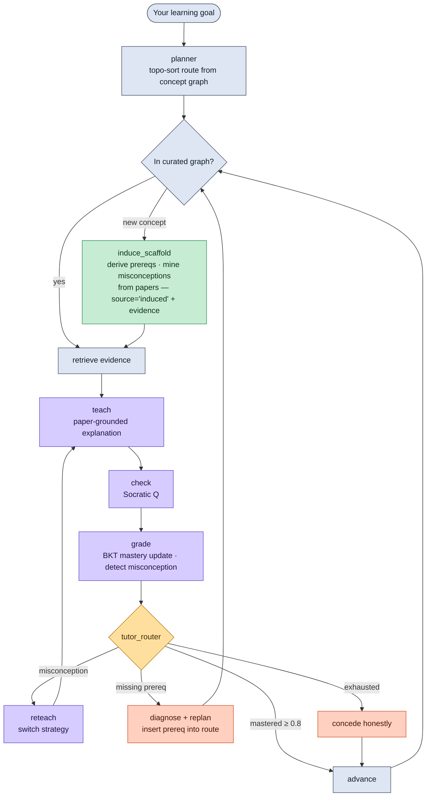

<div align="center">

# 🧭 LitNavigator

### An AI tutor that reads the research papers and then teaches *you* — step by step, adapted to what you actually know.


</div>

---

## The gap nobody fills

> *You have a pile of papers. You need to understand the field. Who explains it to you?*

| | Models you | Adaptive teach/test/reteach | Prereq sequencing | Misconception diagnosis | From living literature | Curriculum source |
|:--|:--:|:--:|:--:|:--:|:--:|:--|
| Elicit / SciSpace | ✗ | ✗ | ✗ | ✗ | ✓ | — |
| NotebookLM | ✗ | ✗ | ✗ | ✗ | ✓ | — |
| Khanmigo / LearnLM | ✓ | ✓ | ✓ | ✓ | ✗ | human-authored |
| **LitNavigator** | ✓ | ✓ | ✓ | ✓ | ✓ | **induced from papers** |

That last column is the empty square: an adaptive tutor whose syllabus, prerequisites, and misconceptions are all derived from the open research frontier.

---

## How it works



**Three loops in one system:**

| Loop | What it does |
|:--|:--|
| **Outer** `planner → advance / replan` | Decides what concept comes next; inserts a missing prereq the moment a quiz exposes the gap |
| **Inner** `teach → check → grade → reteach` | Teaches one concept; switches explanation strategy on a detected misconception; honestly concedes rather than looping forever |
| **Induction** `induce_scaffold` | When you step off the graph, induces prereqs and mines misconceptions from the corpus — confidence computed by a transparent evidence rule, never hallucinated |

---

## Three demo moments

```
① "Let me re-explain from a different angle."          [M2 ✅ implemented]
   You think ReAct is just chain-of-thought prompting.
   → Misconception detected, strategy switches direct → analogy,
     mastery rises past threshold, route advances. (If it still won't land
     after the strategies are exhausted, the tutor concedes honestly.)

② "You need to shore this up first."                    [M1 ✅ implemented]
   A quiz reveals a missing prerequisite.
   → Prereq inserted mid-session. route_version increments.

③ "This concept isn't in your map yet — let me go to the papers."   [M3 next]
   You ask about an off-graph agent concept.
   → induce_scaffold reads the corpus, derives a prereq edge, mines one
     misconception, teaches it as "still-contested", every claim backed by chunk id.

The demo corpus is the agent-paper pack in `papers/agent-competition/` (ReAct,
Toolformer, Reflexion, Generative Agents, Voyager, the autonomous-agents survey,
MetaGPT, CAMEL). M2's tutor loop runs on this agent domain end to end.
```

---

## Built for your purpose, not just your topic

The same engine re-scopes to *why* you need the field — because its curriculum is induced from the live literature, not authored once. Two intents on the same agents corpus:

- **Researcher entering the field** → the full prerequisite chain (ReAct → tool use → reflection → memory → multi-agent), methods, and the open problems worth working on; high mastery bar; contested/open points framed as research opportunities.
- **Journalist prepping to interview an AI scientist** → a 30-minute orientation: what an LLM agent is, the 2–3 landmark ideas, where the live debates are, and good questions to ask; a "can hold the conversation" bar; implementation skipped; the consensus-vs-controversy map as talking points.

A fixed-curriculum tutor has no curriculum for an arbitrary subfield to re-scope, and a static source assistant won't reorder around your goal — LitNavigator can. *(Intent modes are an M4 item; the learner model, route, depth, and frontier labels they build on already exist.)*

---

## Quick start

```bash
pip install -r requirements.txt
python -m litnav.evaluation.verify_m0   # G0: state machine + SQLite writes
python -m litnav.evaluation.verify_m1   # G1: route replans on a prereq gap (LangGraph + checkpoint)
python -m litnav.evaluation.verify_m2   # G2: teach/reteach/concede + misconception detection (agent corpus)
pytest -q                               # full test suite
```

Expected `verify_m0` output:
```
G0 PASS: session written
G0 PASS: route written
G0 PASS: learner_state updated
G0 PASS: quiz_attempt written
G0 PASS: decision written
G0 PASS: offline run
```

> M0 and M1 require no LLM key and no network access. The LLM (Qwen, with offline fallback) enters at M2.

---

## Roadmap

| Milestone | What it proves | Status |
|:--|:--|:--:|
| **M0** · Fake-data walking skeleton | State machine loop + SQLite persistence | ✅ Done |
| **M1** · Navigator | Route changes because of learner state; LangGraph StateGraph + prereq replan + SqliteSaver checkpoint (G1 green) | ✅ Done |
| **M2** · Tutor | teach → reteach → concede on the agent corpus; misconception detection (Qwen / offline fallback); parallel-form quizzes; learning gain (G2 green) | ✅ Done |
| **M3** · Literature induction | `induce_scaffold` — the core novelty; confidence rule-computed | ⬜ Next |
| **M4** · Polish | thin web UI, hybrid retrieval, cross-session memory | ⬜ |

> Every milestone is a self-contained, demoable, submittable build — no matter where progress stops.
> Gates run fully offline (`verify_m0/1/2`); the LLM (Qwen) is an optional path in M2/M3 with deterministic fixtures as fallback. The thin web panel remains the outstanding UI item, carried into M3/M4.

---

## Design principles

- **Nothing is black-box.** Every routing decision leaves a rationale chain: answer → concept/misconception → action taken.
- **Confidence ≠ mastery.** After one question, mastery may look high but confidence is low — the system says so explicitly.
- **Induced scaffolding is never silent.** Induced prereqs and misconceptions are marked `source='induced'`, with evidence chunks and rule-computed confidence attached.
- **Honest concede.** If the system has tried multiple explanations and hasn't gotten through, it flags low confidence and moves on — it does not pretend to have taught.

---

## Tech stack

`LangGraph` · `SQLite + FTS5` · `Chroma` (M4) · `bge-m3` embeddings (M4) · Qwen (M2+, model-agnostic) · `pytest`

---

## Acknowledgments

Built for the **ICCSE 2026 Agentic AI Competition** (NTU · Tsinghua · Shandong · Xinjiang · UBC · Alibaba).
Compute supported by QoderWork and Alibaba Cloud "Cloud for Research."

**License:** MIT — see [LICENSE](LICENSE).
