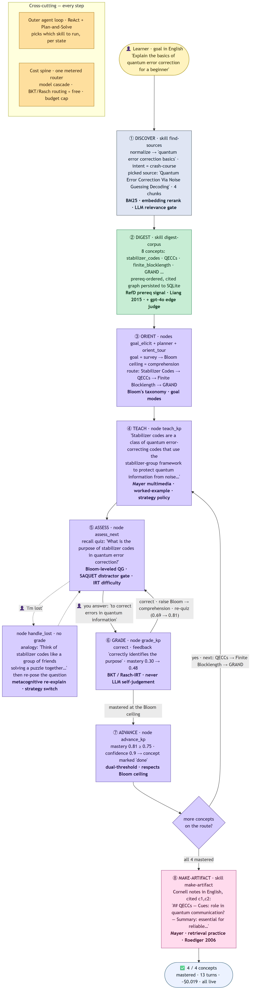

# LitNavigator — Backend: What Ships Today

**Branch:** `feat/open-world-digest` · **Updated:** 2026-06-21  
Tests: **353 passed** (offline, $0). All 7 live gates pass on `LITNAV_LIVE_GATES=1`.

This document describes every shipped backend feature with its implementing skill/code, research
method, and verification status. For architecture rationale and the literature basis, see
[`RESEARCH-AND-SPEC.md`](RESEARCH-AND-SPEC.md). For what is still pending, see
[`BACKEND-ROADMAP.md`](BACKEND-ROADMAP.md).

---

## Concrete run walkthrough

The diagram below shows the full user journey; the table beneath it maps each step to its
research method, skill, and implementation.

The storyboard is grounded in an actual live run — scenario 4 of the 10-scenario suite: *"Explain
the basics of quantum error correction for a beginner"* (English · goal **survey** · learner variant
**lost-then-recover**). The run mastered 4/4 concepts in 13 turns for ~$0.019.

| # | What happened | Method / paper | Skill.md & code |
|--|--|--|--|
| ① | Normalized goal → English query; intent = `crash-course`; discovered one on-topic source after dropping off-topic hits via relevance gate | BM25 · embedding rerank · LLM relevance gate (OW-3.1) | `litnav/discover/SKILL.md` · `query.py` · `intent.py` · `adapters/` · `rank.py` · `relevance.py` |
| ② | Extracted 8 concepts, built prereq + similarity edges, persisted cited concept graph to SQLite | RefD (Liang 2015) + LLM judge; GraphRAG-style; gpt-4o verify | `litnav/digest/SKILL.md` · `extract.py` · `edges.py` · `refd.py` · `verify.py` · `pipeline.py` |
| ③ | Classified goal = `survey` → Bloom ceiling = `comprehension`; planned prereq-ordered route; gave roadmap | Bloom's taxonomy; goal modes (mastery/functional/survey) | `nodes/goal_elicit.py` · `planner.py` · `orient_tour.py` |
| ④ | Taught each keypoint grounded in cited evidence; strategy policy (novice → worked-example) | Mayer multimedia · Sweller worked-example effect | `nodes/teach_kp.py` · `assess/strategy.py` |
| ⑤ | Posed Bloom-leveled quiz; distractors flaw-gated; difficulty calibrated via weaker-simulator IRT | BloomLLM · SAQUET gate · SMART (IRT) | `nodes/assess_next.py` · `assess/quizgen.py` |
| ⑤′ | Learner signalled confusion → re-explain without grading (analogy strategy switch) | Metacognitive scaffolding; strategy-switch | `nodes/handle_lost.py` |
| ⑥ | Graded answer → BKT mastery update 0.30→0.48; frontier escalation not triggered (confident correct below threshold) | BKT (Corbett & Anderson 1995); Rasch-IRT; never LLM self-judge | `nodes/grade_kp.py` · `state.py` |
| ⑥′ | Correct → raised Bloom level; re-quizzed; mastery 0.69→0.81 (capped at survey ceiling) | Bloom ladder + ceiling fix (A12-series) | `grade_kp.py assess_decider` |
| ⑦ | mastery 0.81 ≥ 0.75 + confidence 0.9 → concept marked done; next concept selected | Dual-threshold advance | `nodes/route_decider.py` · `advance_kp_node` |
| 🔁 | Repeated ④–⑦ for all 4 concepts | Prereq-ordered route | `select_next.py` · LangGraph loop |
| ⑧ | Produced Cornell notes in the learner's language (English), with resolving citations | Mayer · Roediger & Karpicke 2006 (testing effect); A8 output-language | `litnav/artifact/SKILL.md` · `selector.py` · `renderers/` |
| ⑨ | Recommended next concepts (prereq-aware, mastery-gain ranked) | Hard-prereq filter + soft ranker | `litnav/recommend/SKILL.md` · `recommend_next.py` |
| ✻ | Outer agent picks skill per state | ReAct (Yao 2022) + Plan-and-Solve (Wang 2023) | `litnav/graph/builder.py` (LangGraph StateGraph + SqliteSaver) |
| ✻ | Every LLM/embed call metered; cheap tier by default; frontier only when needed | FrugalGPT · RouteLLM (ACL 2025) | `litnav/llm/{router,registry,result_cache}.py` · `storage/cost_repo.py` |

---

## Feature inventory by milestone

### Phase 0 — LLM liveness precondition
- `litnav/llm/client.py`: `LivenessError`, `was_live()`, `LITNAV_LLM_STRICT`.
- Strict mode makes a real call provably distinct from a silent fallback (dead provider raises,
  never silently returns fixture).
- **Gate:** `verify_liveness` (LIVE). Live result: real "pong" = 18 tokens / $0.000007; forced
  error raises in strict mode.

### OW-0 — Cost spine
- `litnav/llm/registry.py`: `MODEL_REGISTRY` — enabled: `cheap` (gpt-4o-mini), `frontier`
  (gpt-4o), `embed` (text-embedding-3-small); record-only: mid / reranker / tutor-dpo-small.
- `litnav/llm/router.py`: single metered chokepoint; tier routing; per-session budget cap + 80%
  alert; refuses any model not in the registry.
- `litnav/llm/result_cache.py`: exact-hash + cosine ≥ 0.92 semantic result cache.
- `storage/cost_repo.py` + `cost_ledger` table.
- **Gate:** `verify_cost` (offline math/refusal) + `verify_cost_live` (budget cap fires on real spend).

### OW-1 — Data model
- `storage/schema.py`: concepts `source`/`domain`/`slice_key`; concept_edges `similarity` edge
  type + `confidence` + `slice_key`; keypoints `bloom_level`; quiz_items `distractors_json` +
  `irt_b`; papers `source_type`/`url`/`source_id`; learner_state `irt_theta`; new tables:
  `learner_goal`, `review_queue`, `digest_cache`, `cost_ledger`, `result_cache`, `discover_results`.
- `storage/repo.py` + `storage/openworld_repo.py`: typed writer helpers.
- **Note:** embeddings live in `chunk_vectors` (JSON vector), not as `embedding BLOB` on
  `paper_chunks`. IRT difficulty in `irt_b REAL`; legacy `difficulty` INTEGER kept unchanged.
  JSON columns use un-suffixed names (`evidence` not `evidence_json`).

### OW-2 — digest-corpus
- `litnav/digest/`: `extract.py` (granular concept/keypoint extraction, cheap tier, temp=0,
  cached), `edges.py` (prereq proposals via LLM + cosine similarity), `refd.py` (RefD
  reference-distance signal), `verify.py` (frontier gpt-4o judge; RefD-or-judge logic; downgrade
  unsupported edges to similarity), `pipeline.py` (orchestrate → write source=digested → slice cache).
- **A11 (closed):** moved similarity judge to cheap tier; frontier kept only for prereq verify.
  Digest cost reduced ~5×.
- **`litnav/digest/SKILL.md`** present.
- **Gate:** `verify_digest` (offline determinism) + `verify_digest_live` (gpt-4o judge fires on
  real sources; concepts persist; keypoint evidence resolves).
- Live result: 8 concepts, RefD recovered a prereq (`in_context_learning → agentic_reasoning`)
  the LLM judge alone rejected. ~$0.003/digest.

### OW-3 — find-sources + OW-3.1
- `litnav/discover/`: `intent.py` (cheap LLM classifier + heuristic), `adapters/openalex.py`
  (discovery + citation authority), `adapters/wikipedia.py` (background knowledge), `rank.py`
  (BM25 prefilter → embedding-cosine rerank + authority + dedup), `fulltext.py` (arXiv PDF
  reuse for top-k), `find_sources.py` (orchestrator + semantic query cache).
- **OW-3.1 additions:** `discover/query.py::to_search_query` normalizes any-language goals to
  English; `discover/relevance.py::relevance_gate` drops off-topic sources post-ranking,
  pre-fulltext (keeps ≥ min_keep by rank). Both pass through deterministically at `provider=none`.
- **Impact:** source relevance 44% → 100%; non-English discovery 0/4 → 4/4 (Spanish Black-Scholes,
  中文 CRISPR-Cas, French GNN all return on-topic sources).
- **`litnav/discover/SKILL.md`** present.
- **Gate:** `verify_discover` (offline parse/rank/dedup) + `verify_discover_live` (real
  OpenAlex/Wikipedia + arXiv full text). ~$0.0001/discover.
- **Deferred:** Semantic Scholar + youtube-transcript adapters; standalone arXiv search;
  iterative rounds for systematic intent; SPECTER rerank.

### OW-4 — TEACH/ASSESS extensions
- `litnav/nodes/goal_elicit.py`: 1-turn goal classification → `bloom_ceiling`; routes to teach.
- `litnav/assess/quizgen.py`: distractors overgenerate-and-rank + SAQUET flaw gate + weaker-
  simulator `irt_b` difficulty (cheap model simulates student errors better).
- `litnav/assess/spacing.py`: FSRS-lite `review_queue` + `retention_log` predicted-vs-actual.
- `litnav/assess/strategy.py`: goal × expertise × KT-state policy + metacognitive anti-over-help reteach.
- `nodes/grade_kp.py`: frontier escalation when grader confidence low + near mastery threshold
  (pedagogical-error-cost routing, not token-cost routing).
- A12: `nodes/diagnose.py` + `nodes/replan.py` — prereq-detour on keypoint path.
- A13: goal-pivot helper (`nodes/goal_pivot.py`) — mid-session intent change.
- Bloom-ceiling fix: `assess_decider` stops Bloom upgrade at the ceiling and runs concept-level
  mastery check; fixed infinite re-quiz on survey/functional goals (regression test:
  `tests/test_bloom_ceiling_advance.py`).
- **Gate:** `verify_teach_assess` (offline) + `verify_teach_assess_live`.
- Live result: goal classified (`mastery`), 3 distractors pass flaw gate, grade metered.
  $0.000043 (goal) + $0.000068 (grade) + $0.000039 (quizgen) = **$0.00015/session**.

### OW-5 — make-artifact + OW-5.1
- `litnav/artifact/`: `contract.py` (ArtifactInput/ArtifactResult/FORMATS), `selector.py`
  (scenario → format matrix: override→slides→worked_example→combination→mindmap→notes),
  `renderers/mindmap.py` (deterministic Mermaid from concept graph, $0), `renderers/notes.py`
  (Cornell cues+summary, anti-verbatim), `renderers/slides.py` (cheap-LLM JSON outline →
  deterministic Marp emitter), `renderers/worked_example.py` (grounded steps + practice item),
  `make_artifact.py` (select → gather concepts/edges/evidence/citations → render → write).
- Every renderer appends a **retrieval prompt** per segment + a **Citations** section resolving to
  real `paper_chunks`.
- **A8 (closed):** output language from goal language threaded into all renderers + teach/grade/reteach prompts (10/10 language correct across en/中/es/fr).
- **A9 (closed):** sub-chunk full text → granular `c0..cN` per chunk (no longer collapse to `c0`).
- **OW-5.1 persistence-chain repair** (exposed by fresh-topic live e2e):
  - `create_concept` `INSERT OR IGNORE` dropped every concept when `frontier_flag` outside CHECK set → coerced to NULL.
  - Keypoint `evidence_chunk_id` `'1','2'…` didn't match `cN` IDs → normalized at write time.
  - `make_artifact` read only `paper_chunks.concept_id` (NULL for digested data) → now gathers via
    keypoint objectives + source-chunk pool fallback.
  - `verify_digest_live` now asserts concepts PERSIST + keypoint evidence resolves; `verify_openworld_e2e_live` added.
- **`litnav/artifact/SKILL.md`** present.
- **Gate:** `verify_artifact` (offline) + `verify_artifact_live`.
- Live result: selector picks correct format for all 5 scenarios; mind-map + combination run at $0
  (deterministic); 4 cheap calls for notes+slides+worked = **~$0.0004/multi-format run**.

### OW-6 — recommend-next + unified frontend
- `litnav/recommend/recommend_next.py`: hard-prereq filter (concepts whose prereqs are all mastered
  or reachable via similarity edge) → soft rank by expected mastery gain (BKT KT) with LLM tie-break.
- **`litnav/recommend/SKILL.md`** present.
- **A14 (closed):** goal-specific relevance gate in discovery (precision, not just adjacency).
- **A15 (closed):** quiz variety improvements (fewer repeated questions per concept).
- **A16 (closed):** explain-why feedback depth.
- Unified glass-box + user frontend (P6): one page `/tutor/{sid}` with chat + glass-box; per-step
  skill/method/paper chips from `litnav/ui/flow_meta.py`; live mastery/confidence scores; concept-map
  SVG; cited evidence; cost meter; recommend-next card. See [`FRONTEND-COMPLETE.md`](FRONTEND-COMPLETE.md).

### Quality fixes (A8/A9/A11/A14/A15/A16)
Summary of the post-10-scenario-eval quality actions (all closed before the final E2E):
- **A8** — output-language localization (5.0/5.0 on final eval)
- **A9** — sub-chunk full text (granular citations)
- **A11** — digest cost ~5× spike from frontier similarity-judge → moved to cheap tier
- **A14** — discovery relevance precision: goal-specific gate (source_relevance 4.0 → 4.78)
- **A15** — quiz variety (quiz_quality 3.5 → 3.78)
- **A16** — feedback depth: explain-why (feedback_quality 3.3 → 3.89)

---

## SKILL.md files

| File | Skill |
|---|---|
| `litnav/discover/SKILL.md` | find-sources |
| `litnav/digest/SKILL.md` | digest-corpus |
| `litnav/artifact/SKILL.md` | make-artifact |
| `litnav/recommend/SKILL.md` | recommend-next |

The teach/assess inner loop is implemented as LangGraph nodes (no separate SKILL.md — it is the
graph spine, not a composable skill).

---

## Test counts and gate list

**Offline (deterministic, $0, no key):**
`verify_m0` · `verify_m1` · `verify_m2` · `verify_m3` · `verify_cost` · `verify_digest` ·
`verify_discover` · `verify_teach_assess` · `verify_artifact` — all green.
`pytest -q` → **353 passed**.

**Live gates** (`LITNAV_LIVE_GATES=1`, real provider, metered):

| Gate | Last result | Cost |
|---|---|---|
| `verify_liveness` | ALL PASS | $0.000007 |
| `verify_cost_live` | ALL PASS (cap fires) | ~$0.00001 |
| `verify_digest_live` | ALL PASS (gpt-4o judge; RefD recovers edge) | ~$0.0014 |
| `verify_discover_live` | ALL PASS (6 sources; OpenAlex/Wikipedia/arXiv) | ~$0.0021 |
| `verify_teach_assess_live` | ALL PASS (goal classify / distractors / metered grade) | ~$0.00015 |
| `verify_artifact_live` | ALL PASS (notes/slides/worked live; citations resolve) | ~$0.0004 |
| `verify_openworld_e2e_live` | ALL PASS (fresh topic discover→digest→teach→artifact; persisted graph) | ~$0.003 |

Full 10-scenario live evaluation results: [`E2E-REPORT.md`](E2E-REPORT.md).
