# Backend — Complete Reference

*Everything the LitNavigator backend does, in plain language, with the research method, the code that
implements it, the module/node/data-model index, and how it's verified.* Design rationale:
[RESEARCH-AND-SPEC](RESEARCH-AND-SPEC.md). Remaining work: [BACKEND-ROADMAP](BACKEND-ROADMAP.md).
Measured quality: [E2E-REPORT](E2E-REPORT.md). The UI on top: [FRONTEND-COMPLETE](FRONTEND-COMPLETE.md).

**Status:** 557 automated tests pass offline ($0), with 16 live-gated (573 total); all live gates pass against a real provider.
A full multi-concept session (find → digest → teach → artifact → recommend) costs about **$0.02**.
Provider-agnostic: OpenAI / Anthropic / Gemini / DeepSeek / … via LiteLLM (§7).

> Covers all backend modules after the June 2026 pull: open-world discover/digest, recommend-next,
> downloadable artifact, and provider-agnostic LLM access.

---

## 1. System Architecture (ASCII)

```
  {goal, in any language}
        │
        ▼
  ┌──────────────────────────────────────────────────────────────────────┐
  │  Outer agent loop — ReAct + Plan-and-Solve  (litnav/graph/builder.py)  │
  │  picks which stage skill to run, per state                            │
  └──────────────────────────────────────────────────────────────────────┘
        │              │              │              │              │
        ▼              ▼              ▼              ▼              ▼
  ┌──────────┐  ┌───────────┐  ┌─────────────┐  ┌────────────┐  ┌──────────────┐
  │ find-    │  │ digest-   │  │ teach/assess│  │ make-      │  │ recommend-   │
  │ sources  │─►│ corpus    │─►│ inner loop  │─►│ artifact   │─►│ next         │
  │ discover/│  │ digest/   │  │ nodes/+graph│  │ artifact/  │  │ recommend/   │
  └──────────┘  └───────────┘  └─────────────┘  └────────────┘  └──────────────┘
        │              │              │              │              │
        └──────────────┴───────┬──────┴──────────────┴──────────────┘
                               ▼
        ┌───────────────────────────────────────────────────────────┐
        │  Concept graph + learner model + ledger   (SQLite)         │
        │  concepts · concept_edges · keypoints · quiz_items ·        │
        │  papers · paper_chunks · learner_state · cost_ledger · …    │
        └───────────────────────────────────────────────────────────┘
                               ▲
        ┌───────────────────────────────────────────────────────────┐
        │  Metered router  (litnav/llm: router → registry → client)  │
        │  one chokepoint · tiered (cheap/frontier/embed) · budget    │
        │  cap · cache · strict-liveness · LiteLLM (any provider)     │
        └───────────────────────────────────────────────────────────┘
```

Five contracted **stage skills** orchestrated by an outer agent loop, all sharing one **concept
graph** (SQLite) as the spine and one **metered router** for every model call. Honesty invariants:
mastery / confidence / routing are rule-computed, never emitted by the model; every taught claim and
artifact is grounded in cited source chunks.

---

## 2. A real session, end to end

This is an actual live run (goal: *"Explain the basics of quantum error correction for a beginner"*,
survey depth, a learner who gets confused once then recovers). It mastered 4 concepts in 13 turns for
~$0.019.

```mermaid
flowchart TD
    U(["👤 Learner · goal in English<br/>'Explain the basics of quantum error correction for a beginner'"])

    U --> S1["① DISCOVER · skill find-sources<br/>normalize → 'quantum error correction basics' · intent = crash-course<br/>picked source: 'Quantum Error Correction Via Noise Guessing Decoding' · 4 chunks<br/><b>BM25 · embedding rerank · LLM relevance gate</b>"]
    S1 --> S2["② DIGEST · skill digest-corpus<br/>8 concepts: stabilizer_codes · QECCs · finite_blocklength · GRAND …<br/>prereq-ordered, cited graph persisted to SQLite<br/><b>RefD-style prereq signal · cf. Liang 2015 · + gpt-4o edge judge</b>"]
    S2 --> S3["③ ORIENT · nodes goal_elicit + planner + orient_tour<br/>goal = survey → Bloom ceiling = comprehension<br/>route: Stabilizer Codes → QECCs → Finite Blocklength → GRAND<br/><b>Bloom's taxonomy · goal modes</b>"]

    S3 --> T["④ TEACH · node teach_kp<br/>'Stabilizer codes are a class of quantum error-correcting codes that use the<br/>stabilizer-group framework to protect quantum information from noise…'<br/><b>Mayer multimedia · worked-example · strategy policy</b>"]
    T --> Q["⑤ ASSESS · node assess_next<br/>recall quiz: 'What is the purpose of stabilizer codes in quantum error correction?'<br/><b>Bloom-leveled QG · SAQUET distractor gate · IRT difficulty</b>"]
    Q -. "👤 'I'm lost'" .-> L["node handle_lost · no grade<br/>analogy: 'Think of stabilizer codes like a group of friends<br/>solving a puzzle together…' then re-pose the question<br/><b>metacognitive re-explain · strategy switch</b>"]
    L -.-> Q
    Q -- "👤 you answer: 'to correct errors in quantum information'" --> G["⑥ GRADE · node grade_kp<br/>correct · feedback 'correctly identifies the purpose' · mastery 0.30 → 0.48<br/><b>BKT-lite · never LLM self-judgement</b>"]
    G -- "correct · raise Bloom → comprehension · re-quiz (0.69 → 0.81)" --> Q
    G -- "mastered at the Bloom ceiling" --> ADV["⑦ ADVANCE · node advance<br/>mastery 0.81 ≥ 0.75 · confidence 0.9 → concept marked 'done'<br/><b>dual-threshold · respects Bloom ceiling</b>"]
    ADV --> NX{more concepts<br/>on the route?}
    NX -- "yes · next: QECCs → Finite Blocklength → GRAND" --> T
    NX -- "all 4 mastered" --> ART

    ART["⑧ MAKE-ARTIFACT · skill make-artifact<br/>Cornell notes in English, cited c1,c2:<br/>'## QECCs — Cues: role in quantum communication? — Summary: essential for reliable…'<br/><b>Mayer · retrieval practice · Roediger 2006</b>"]
    ART --> DONE(["✅ 4 / 4 concepts mastered · 13 turns · ~$0.019 · all live"])

    subgraph X ["Cross-cutting — every step"]
      direction LR
      OL["Outer agent loop · ReAct + Plan-and-Solve<br/>picks which skill to run, per state"]
      CS["Cost spine · one metered router<br/>model cascade · rule-computed routing ≈ free · budget cap"]
    end

    classDef disc fill:#dde6f2,stroke:#3f4b5e,color:#0f1b2b;
    classDef dig fill:#c7ecd4,stroke:#258a51,color:#0c3019;
    classDef teach fill:#d7ccff,stroke:#5b49c4,color:#1c1444;
    classDef art fill:#ffd9ec,stroke:#b03a7a,color:#3d0f27;
    classDef store fill:#eaf3ff,stroke:#2d5d8f,color:#0f1b2b;
    classDef spine fill:#ffdf9e,stroke:#b3700d,color:#43280a;
    classDef user fill:#fff3bf,stroke:#b08900,color:#3d2e00;
    class U user; class S1 disc; class S2 dig; class S3 teach;
    class T,Q,L,G,ADV,NX teach; class ART art; class DONE store; class OL,CS spine;
```



| Step | What the learner experiences | Method | Code |
|--|--|--|--|
| ① Find sources | Goal → English query; pulls real papers and **drops off-topic ones** | BM25 + embedding re-rank; cheap-LLM relevance check | `litnav/discover/` |
| ② Build the map | Source → concepts with prerequisite links and cited evidence | RefD-style (cf. Liang 2015) + a `gpt-4o` judge | `litnav/digest/` |
| ③ Set the depth | "Survey" → teach to *comprehension* Bloom level; plan a prereq route | Bloom's taxonomy | `nodes/goal_elicit.py`, `nodes/planner.py` |
| ④ Teach | Each idea explained concisely, **grounded in the cited paper** | Mayer + worked-example | `nodes/teach_kp.py` |
| ⑤ Quiz | A question at the current Bloom level; distractors flaw-checked | Bloom-leveled QG + SAQUET + IRT | `nodes/assess_next.py`, `assess/quizgen.py` |
| ⑤′ "I'm lost" | Re-explain with an analogy, **no penalty** | metacognitive re-explain | `nodes/handle_lost.py` |
| ⑥ Grade | The answer updates a real mastery estimate — never self-graded | BKT-lite (cf. BKT, Corbett & Anderson 1995) | `nodes/grade_kp.py` |
| ⑦ Advance | Mastery ≥ threshold → done; else reteach or honestly concede | dual-threshold | `nodes/route_decider.py`, `nodes/advance.py` |
| ⑧ Take-away | Notes/slides/map **in the learner's language**, cited | Mayer + retrieval-practice (Roediger 2006) | `litnav/artifact/` |
| ⑨ What next | Prerequisite-aware ranked next concepts | hard-prereq filter + mastery-gain ranker | `litnav/recommend/` |

---

## 3. Module index

| Package | Role |
|--|--|
| `litnav/graph/` | LangGraph `StateGraph` builder + `make_initial_state`; `SqliteSaver` checkpoint |
| `litnav/state.py` | `NavState` — the state contract threaded through every node |
| `litnav/nodes/` | the teaching-graph nodes (§5) |
| `litnav/assess/` | quiz generation (`quizgen`), teach-strategy policy (`strategy`), spaced repetition (`spacing`) |
| `litnav/discover/` | **find-sources** skill: intent, query, selectable adapter registry (OpenAlex · Semantic Scholar · arXiv · Wikipedia + Stack Overflow opt-in), rank, relevance, full-text |
| `litnav/digest/` | **digest-corpus** skill: extract → edges (RefD-style) → verify → pipeline |
| `litnav/artifact/` | **make-artifact** skill: selector + renderers (mindmap/notes/slides/worked-example) |
| `litnav/recommend/` | **recommend-next** skill: prereq filter + mastery-gain ranker |
| `litnav/llm/` | metered spine: `router` → `registry` → `client` (LiteLLM), `result_cache` |
| `litnav/storage/` | `schema` (idempotent migrations), `repo` helpers, `seed`, `cost_repo` |
| `litnav/retrieval/` | optional embedding/vector retrieval (opt-in via `LITNAV_RETRIEVAL=vector`) |
| `litnav/ingest/` | PDF/source ingestion helpers (corpus prep) |
| `litnav/evaluation/` | offline acceptance gates + live gates + the inner-loop scenario harness |
| `litnav/ui/` | FastAPI app + templates ([FRONTEND-COMPLETE](FRONTEND-COMPLETE.md)) |
| `litnav/{intent,goal,conversation,grading,config}.py` | intent resolve · goal resolve · dispatcher · grading math · env/config |

---

## 4. The five stage skills

Each is a contracted, separately-testable skill the outer agent invokes. Skills with a `SKILL.md`
contract: **find-sources**, **digest-corpus**, **make-artifact**, **recommend-next**. Teach/assess is
the LangGraph spine itself.

### find-sources — discover real sources for any goal
`litnav/discover/` · `SKILL.md`
- Normalises any-language goal → English search query (`query.py`) so non-English goals find sources.
- Classifies intent (`intent.py`), queries a **selectable adapter registry** (`adapters/registry.py`
  — OpenAlex · Semantic Scholar · arXiv · Wikipedia default-on; Stack Overflow opt-in), ranks by BM25
  then embedding similarity + citation authority, de-dups (`rank.py`).
- **Relevance gate** (`relevance.py`): a cheap LLM scores each source's fit to the *specific* goal and
  drops adjacent-but-wrong ones (e.g. a PBFT paper for a Raft goal), never starving the pipeline.
- Fetches full text for the top few and sub-chunks it into citable units (`fulltext.py`).
- *Measured:* on-topic selection 44% → ~100% on in-domain scenarios; non-English 0/4 → 4/4.
  **Live gate:** `verify_discover_live` (~$0.0002).

### digest-corpus — turn sources into a teachable concept graph
`litnav/digest/` · `SKILL.md`
- Extracts distinct concepts + keypoints from the source text, grounded in chunks (`extract.py`).
- Proposes prerequisite + similarity edges; prerequisites use a **RefD-style** reference-distance
  signal (corpus reference-distance, cf. Liang 2015 / ACE, JEDM 2024) blended with an LLM judge
  (`refd.py`, `edges.py`); a frontier judge verifies high-impact prerequisite
  edges and downgrades unsupported ones (`verify.py`). The similarity judge runs on the cheap tier.
- Persists concepts, edges, keypoints, quiz seeds, cited chunks (`pipeline.py`); confidence is always
  rule-computed, never returned by the model.
- *Measured:* prerequisite edges survive on real evidence (the RefD-style signal recovers links a lone LLM judge
  rejects). **Live gate:** `verify_digest_live` (~$0.003/digest).

### teach / assess — the adaptive inner loop
`litnav/nodes/` + `litnav/assess/` (the checkpointed LangGraph state machine — see §5)
- **Goal elicitation** (`goal_elicit.py`): one turn sets the Bloom ceiling (survey→comprehension,
  functional/mastery→application). `repivot_goal()` re-elicits if the learner changes goal mid-session.
- **Teaching** (`teach_kp.py`): keypoint-by-keypoint, evidence-grounded; strategy (worked-example /
  analogy / concise…) chosen from goal × expertise × current mastery (`assess/strategy.py`).
- **Assessment** (`assess_next.py`, `assess/quizgen.py`): questions at rising Bloom levels (varied so
  they don't repeat), distractors flaw-gated (SAQUET), difficulty estimated by a weaker "student" (IRT).
- **Grading** (`grade_kp.py`): mastery updated by a BKT-lite heuristic (Bloom-weighted; cf. BKT,
  Corbett & Anderson 1995) from the real answer; feedback explains
  *why*; when the cheap grader is unsure near threshold it escalates once to the frontier model.
- **Routing** (`route_decider.py`): advance at mastery + confidence; reteach on a wrong answer;
  re-explain on "I'm lost" without grading; if a failed concept has an un-mastered prerequisite, detour
  to teach it first (`diagnose.py` → `replan.py`); concede honestly if stuck.
- **Spacing** (`assess/spacing.py`): an FSRS-style review schedule after mastery.
- *Measured:* across 10 live scenarios all four branches fire correctly; teaching is in the learner's
  language. **Live gate:** `verify_teach_assess_live` (~$0.0002/turn-set).

### make-artifact — a take-away in the learner's language
`litnav/artifact/` · `SKILL.md`
- Picks the format for the scenario (`selector.py`): mind-map, Cornell notes, slides, worked-example,
  or a combination.
- Renderers (`renderers/`): mind-map is deterministic Mermaid ($0); notes/slides/worked-example use a
  cheap LLM grounded in the concept's evidence and **write in the learner's language**.
- Every artifact carries a retrieval-practice prompt and a citations section that resolves to real
  source chunks. Surfaced in the UI as a download. **Live gate:** `verify_artifact_live` (~$0.0004).

### recommend-next — what to learn next
`litnav/recommend/` · `SKILL.md`
- Hard filter: a concept is eligible only if its prerequisites are mastered. Soft rank: by how many
  further concepts it unlocks. Deterministic (no LLM); returns "ready now" vs "blocked — needs X
  first". **Gate:** `verify_recommend` (offline).

---

## 5. The teaching graph — node reference

`litnav/graph/builder.py` compiles a LangGraph `StateGraph` over `NavState`, checkpointed to SQLite
(`SqliteSaver`), interrupting after `check` / `assess_next` so a real learner answer can be injected.
Two teaching paths fork at `retrieve` by whether the concept has keypoints.

| Node | Path | Role |
|--|--|--|
| `planner` | both | Plan a prerequisite-ordered route over the target concepts |
| `goal_elicit` | both | Goal → Bloom ceiling; `repivot_goal()` handles a mid-session goal change |
| `orient_tour` | keypoint | Walk the concept roadmap before teaching |
| `select_next` | both | Pick the next concept on the route |
| `retrieve` | both | Fetch the cited evidence chunks for the current concept |
| `teach_kp` / `teach` | keypoint / legacy | Teach (grounded in evidence), strategy chosen per learner |
| `assess_next` / `check` | keypoint / legacy | Pose a quiz at the current Bloom level |
| `grade_kp` / `grade` | keypoint / legacy | Grade for the key idea; BKT-lite (keypoint) / BKT posterior (legacy) mastery update; route decision |
| `reteach_kp` / `reteach` | keypoint / legacy | Re-teach with a new strategy after a wrong answer |
| `handle_lost` | keypoint | Re-explain from a different angle, **no grade** |
| `route_decider` | legacy | Branch: advance / reteach / diagnose→replan / concede |
| `advance` | both | Mark the concept done; schedule spaced review |
| `diagnose` → `replan` | both | Detour to teach a missing prerequisite, then re-plan |
| `concede` | both | Honest give-up (never claims mastery it didn't reach) |
| `lecture` | both | End a no-quiz concept (survey/functional depth) |
| `induce` | off-graph | `induce_scaffold` derives a prereq + misconception for an off-graph concept |

---

## 6. Data model (SQLite)

| Table(s) | Holds |
|--|--|
| `concepts` | slug, name, source, domain |
| `concept_edges` | prerequisite / similarity edges; confidence; evidence; `human_checked` |
| `keypoints` | objective, Bloom level, evidence chunk id |
| `quiz_items` | stem, answer key, distractors, IRT difficulty |
| `papers`, `paper_chunks` | the cited evidence (source text, chunk index) |
| `learner_state` | mastery + confidence per concept per session; held misconceptions |
| `sessions`, `route_steps` | session metadata; the planned route + per-step status |
| `tutor_turns`, `decisions`, `quiz_attempts` | the teaching transcript + routing decisions + answers |
| `induction_log` | off-graph induction events |
| `review_queue`, `retention_log` | FSRS spacing schedule + retention probes |
| `cost_ledger` | one metered row per LLM/embedding call (stage, tier, model, tokens, usd) |
| `result_cache`, `digest_cache`, `discover_results` | semantic + stage caches |

Nodes never write raw SQL — they call `litnav/storage/repo.py` helpers; the schema is created/migrated
idempotently by `litnav/storage/schema.py`.

---

## 7. LLM + cost spine (provider-agnostic)

`litnav/llm/` is the single chokepoint for every model call: `router.py` → `registry.py` → `client.py`.

- **router** — resolves a tier, calls the client, reads the per-call token cost, computes USD from the
  tier rate, writes a `cost_ledger` row, and enforces a per-session token budget (80% alert, then
  `BudgetExceeded`). A semantic `result_cache` short-circuits repeat calls.
- **registry** — three tiers: `cheap` (default chat), `frontier` (hard judgements), `embed`. Defaults
  are OpenAI (`gpt-4o-mini` / `gpt-4o` / `text-embedding-3-small`) but every tier's **model and rate
  are env-overridable** (`LITNAV_LLM_MODEL` / `_FRONTIER` / `LITNAV_EMBED_MODEL` / `*_USD_PER_1K`).
- **client** — routes through **LiteLLM**, so any provider works: OpenAI, Anthropic, Gemini, DeepSeek,
  Groq, Mistral, Cohere, Together, OpenRouter, Bedrock, Azure, Ollama / vLLM / any OpenAI-compatible
  server. `LITNAV_LLM_PROVIDER=none` (default) is fully offline ($0); a key flips it live. A guard still
  refuses an in-code model that isn't a configured tier (catches typos).
- **Mixed setup** — embeddings (source re-ranking) can run on a *separate* provider via
  `LITNAV_EMBED_PROVIDER` / `LITNAV_EMBED_API_KEY` / `LITNAV_EMBED_BASE_URL` (each falls back to its
  `LITNAV_LLM_*` counterpart). So a chat-only provider (e.g. Anthropic, no embeddings API) pairs with
  an embedding-capable one (e.g. OpenAI) instead of degrading to keyword-only ranking. If embeddings
  are unavailable they still degrade gracefully (BM25-only, no semantic cache).

Honesty invariant: the client returns content + structured fields only — **mastery, confidence, and
routing are rule-computed**, never emitted by the model. Every caller passes a deterministic fallback.

---

## 8. Verification

**Offline (deterministic, $0):** `verify_cost`, `verify_digest`, `verify_discover`,
`verify_teach_assess`, `verify_artifact`, `verify_recommend`, plus the legacy `verify_m0…m3`. Full
suite: **`pytest -q` → 557 passed, 16 live-gated (skipped without a provider) — 573 total.**

**Live (real provider, metered — run with a provider configured):**

| Gate | Asserts | Cost |
|--|--|--|
| `verify_liveness` | a real call is provably distinct from a fallback | $0.000007 |
| `verify_cost_live` | budget cap fires on real accumulating spend | ~$0.00001 |
| `verify_digest_live` | concepts **persist** + the frontier judge runs + evidence resolves | ~$0.003 |
| `verify_discover_live` | real OpenAlex/Semantic Scholar/arXiv/Wikipedia; relevance gate; multilingual query | ~$0.002 |
| `verify_teach_assess_live` | goal classified, distractors flaw-gated, grade metered | ~$0.0002 |
| `verify_artifact_live` | notes/slides/worked render live; citations resolve | ~$0.0004 |
| `verify_openworld_e2e_live` | a fresh topic runs discover→digest→teach→artifact on the **persisted** graph | ~$0.003 |

The full 10-scenario quality evaluation (frontier-judge scores) is in [E2E-REPORT](E2E-REPORT.md).
