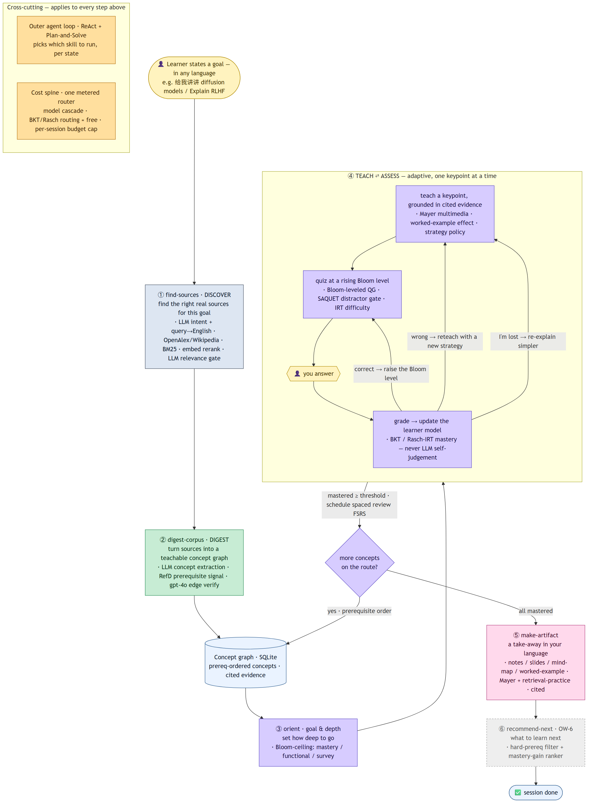

# LitNavigator — Research & Architecture Spec

**Branch:** `feat/open-world-digest` · **Updated:** 2026-06-21

This document consolidates the research brief, literature review, and architecture spec into a single
reference. Sources: `docs/2026-06-20-open-world-research-brief.md`,
`docs/2026-06-20-open-world-literature-review.md`, `docs/open-world-methods.md`,
`docs/2026-06-20-open-world-architecture-spec.md` (all archived; this supersedes them).

---

## (a) Problem & Research Questions

### The gap
Current tools either (a) search the literature but don't teach (Elicit, SciSpace), (b) accept
uploaded documents but can't discover sources (NotebookLM), or (c) teach adaptively but from
human-authored curricula (Khanmigo, LearnLM). No system **discovers the most suitable sources for
any learning goal, digests them into a prereq-ordered concept graph, and then teaches adaptively
from the live literature** — all under strict cost control.

### Research questions
1. Can prerequisite relations be reliably extracted on-the-fly from open-web sources, and how
   should edge uncertainty be handled?
2. Can BKT/Rasch-IRT serve as the authoritative learner model without LLM self-assessment,
   across open-domain, multilingual learner goals?
3. What agent topology (skills, cost routing, caching) keeps an open-domain adaptive tutor
   within a practical per-session budget?
4. Can multi-format artifact generation (mind-map, notes, slides, worked-example) be grounded in
   the Mayer/testing-effect literature and produced at cheap-tier cost?
5. Does a hard-prereq + soft-mastery-gain ranker give actionable next-step recommendations
   without RL?

---

## (b) Literature & Methods Table

Every method or paper used in the current implementation. Evidence levels: I = meta-analysis,
II = RCT/controlled, III = quantitative eval, IV = system/applied, V = metric/dataset.
All sources were live-confirmed (title + arXiv id / venue) on 2026-06-20.

| Method / Paper | Role in LitNavigator | Level |
|---|---|---|
| **RefD — Liang et al., "Measuring Prerequisite Relations Among Concepts," EMNLP 2015** | Non-LLM corpus reference-distance prereq signal (`litnav/digest/refd.py`); blended with LLM judge; recovers prereqs the judge alone rejects | V |
| **LectureBank — arXiv:1811.12181** | Prereq-chain dataset; canonical benchmark for the DIGEST stage | V |
| **KnowLP / GraphRAG-Induced Dual Knowledge Structure Graphs — AAAI 2025, arXiv:2506.22303** | Dual prereq + similarity graph; similarity-fallback when a prereq chain blocks the learner; drives our `similarity` edge type | IV |
| **GraphRAG (Microsoft)** | Entity + typed-relation extraction → community detection → hierarchical summary; pattern for `digest/extract.py` concept/keypoint extraction | IV |
| **Survey — "Personalized Learning Path Recommendation Based on Knowledge Graphs," MDPI Electronics 15(1):238** | Names prereq-edge accuracy as the dominant bottleneck in deployed KG-based tutor systems | I |
| **BKT — Corbett & Anderson 1995** | Bayesian Knowledge Tracing; the mastery ground truth; `litnav/state.py` BKT-lite | II |
| **"Specialised Knowledge Tracing Models Outperform LLMs" — arXiv:2603.02830** | Justifies externalized KT over LLM self-assessment (accuracy + cost) | III |
| **"Confirming Correct, Missing the Rest" — arXiv:2605.16207** | 7 agents, 10,836 pairs; LLMs over-validate wrong reasoning and over-reject valid steps → never judge correctness with the LLM alone | III |
| **Rasch / 1PL (catsim / girth)** | IRT difficulty parameter (`quiz_items.irt_b`); EAP estimator; `irt_theta` on learner state | III |
| **BloomLLM — EC-TEL 2024; Scaria et al. — AIED 2024, arXiv:2408.04394** | Bloom-leveled question generation; strength at lower levels, weakness at Analyze/Evaluate/Create | IV |
| **SAQUET — AIED 2024** | Item-writing-flaw gate at 94%; used in `litnav/assess/quizgen.py` distractor post-filter | IV |
| **SMART — arXiv:2507.05129, EMNLP 2025** | Difficulty via DPO-aligned simulated students + IRT; justifies weaker-simulator design | IV |
| **"Take Out Your Calculators" — arXiv:2601.09953** | NAEP difficulty r≈0.82; weaker models simulate difficulty better; comparison prompting beats absolute scoring | IV |
| **Tutor CoPilot — arXiv:2410.03017** | RCT, 900 tutors / 1,800 K-12 students; +4 p.p. mastery (+9 for lower-rated tutors); anti-over-help grounding | II |
| **ITS meta-analysis — arXiv:2511.04997** | Pooled ITS effect g≈0.27 (modest); worked examples the strongest moderator | I |
| **Mayer, Multimedia Learning** | Coherence/contiguity/modality principles; concise text+graphics; exclude extraneous; drives `teach_kp` and artifact renderers | II |
| **Sweller / Kalyuga — Cognitive Load + Worked-Example + Expertise-Reversal Effects** | Novice→worked-example+direct; intermediate→faded; expert→problem-first; expertise-reversal = switch strategy when novice becomes intermediate | II |
| **FSRS spaced-repetition scheduler** | `litnav/assess/spacing.py`; mastered concepts enter `review_queue`; cadence scales inverse to recall probability | IV |
| **Cepeda et al. 2008 (Psychological Science)** | Optimal first re-check ≈ 10–20% of retention window; two-phase cadence (dense acquisition → FSRS after mastery) | II |
| **Tabibian et al. 2019, MEMORIZE (PNAS)** | 5.2M Duolingo pairs; review frequency should scale inverse to current recall probability | II |
| **Metacognitive feedback (npj Science of Learning 2025, PMC12000334)** | Metacognitive prompts beat affective + neutral on transfer; drives `reteach_kp` metacognitive re-explain | III |
| **Roediger & Karpicke 2006 — "The Power of Testing Memory"** | Testing/retrieval-practice effect; every artifact segment ends with a retrieval prompt | II |
| **BM25 — Robertson & Zaragoza** | Keyword pre-filter before embedding rerank in `discover/rank.py` | V |
| **SPECTER — Cohan et al. 2020 (substituted by `text-embedding-3-small` cosine)** | Semantic rerank of candidate sources; SPECTER deferred, implemented as cosine similarity with `text-embedding-3-small` | IV |
| **STORM — NAACL 2024 (aclanthology.org/2024.naacl-long.347/)** | Multi-perspective question-asking + retrieval for grounded long-form generation; pattern for iterative discover | IV |
| **OpenScholar — arXiv:2411.14199** | Retrieval-augmented LM over 45M papers; cuts citation hallucination; grounds our grounded-explanation principle | III |
| **ReAct — Yao et al. 2022, arXiv:2210.03629** | Reasoning + acting; outer agent loop pattern; `litnav/graph/builder.py` | IV |
| **Plan-and-Solve — Wang et al. 2023** | Front-pass planning before the ReAct loop; orders DISCOVER → DIGEST → TEACH before invoking each skill | IV |
| **FrugalGPT — arXiv:2305.05176** | LLM cascade; up to 98% cost reduction; drives three-tier model registry | III |
| **RouteLLM — arXiv:2406.18665, ICLR 2025** | Learned router; >2× cost saving at parity; cost-spine design reference | III |

---

## (c) Architecture Spec



### Principles (non-negotiable)
1. **Grounded, not bluffing.** All teaching content is cited to retrieved evidence. Open-domain means
   *go fetch and digest a source*, then teach from it.
2. **The learner model is BKT/Rasch, never LLM self-assessment** (2603.02830; 2605.16207).
3. **Cost is a first-class architectural constraint** — three-tier model cascade, caching, per-session
   budget cap, one metered chokepoint. Every LLM/embedding call writes `cost_ledger`.
4. **Concept graph is the spine.** Edges are typed `prerequisite` AND `similarity`; similarity is the
   fallback when a prereq chain blocks the learner (KnowLP/2506.22303).
5. **Determinism where it matters.** The teach/assess inner loop is a reproducible LangGraph state
   machine; only open-ended outer stages are free-form agent calls.
6. **Two surfaces, one engine.** Product Chat (clean) and Glass-box (full technical chain) render the
   same state.

### High-level architecture

```
        ┌──────────────────────────────────────────────────────────┐
user ──▶│  OUTER AGENT LOOP  (ReAct + Plan-and-Solve front pass)    │
goal    │  decides which STAGE SKILL to invoke, in order, per state │
        └───┬───────────────┬───────────────┬───────────────┬───────┘
            │               │               │               │
     ┌──────▼──────┐ ┌──────▼──────┐  ┌─────▼──────┐  ┌─────▼───────┐
     │ find-sources│ │ digest-     │  │ make-      │  │ recommend-  │
     │ (DISCOVER)  │ │ corpus      │  │ artifact   │  │ next        │
     └──────┬──────┘ │ (DIGEST)    │  │            │  └─────┬───────┘
            │        └──────┬──────┘  └─────┬──────┘        │
     OpenAlex/S2/           │               │               │
     Wikipedia/             ▼               │               │
     arXiv/yt          CONCEPT GRAPH ◀──────┴───────────────┘
                            │
                            ▼
        ┌──────────────────────────────────────────────────────────┐
        │  INNER LOOP (deterministic, LangGraph+SqliteSaver)        │
        │  goal_elicit → planner → orient_tour → select_next →      │
        │  retrieve → teach_kp → assess_next → grade_kp → route     │
        │  reads BKT/Rasch learner model; never LLM self-assess     │
        └──────────────────────────────────────────────────────────┘

STORES: concept-graph DB · learner model (BKT/Rasch) · digest cache
        · cost ledger · FSRS review queue
COST:   model-router tier on every LLM call · prompt+semantic cache · metering
```

### Data model

**Concept graph** (SQLite, extends `main`'s schema additively):
- `concepts(id, slug, name, domain, frontier_flag, source ∈ {curated, digested, induced})`
- `concept_edges(prereq_concept, target_concept, edge_type ∈ {prerequisite, similarity}, source, confidence REAL, evidence)`
- `keypoints(id, concept_id, name, objective, evidence_chunk_id, sort_order, bloom_level)`
- `quiz_items(id, concept_id, keypoint_id, bloom_level, qtype, question, answer_key, rubric, distractors_json, difficulty, irt_b REAL, evidence_chunk_id)`
- `paper_chunks(id, paper_id, concept_id, section, text)` + `chunk_vectors` (JSON vector, separate table)
- `papers(id, source_type ∈ {arxiv, wikipedia, youtube, pdf, web}, source_id, title, url)`

**Learner model:**
- `learner_state(session_id, concept_id, mastery REAL, confidence REAL, n_observations, held_misconceptions, tried_strategies, irt_theta REAL)`
- `learner_goal(session_id, goal_text, goal_type ∈ {mastery, functional, survey}, target_concepts_json, created_at)`
- `review_queue(session_id, concept_id, due_at, fsrs_state_json)` — FSRS spacing

**Cost & cache:**
- `digest_cache(slice_key, status, graph_version, built_at, human_checked)` — pure results cache (memoization only; no pre-picked warm domains)
- `cost_ledger(session_id, ts, stage, tier, model, total_tokens, usd, cache_hit)`
- `result_cache` — exact-hash + cosine≥0.92 semantic cache

### Cost spine (OW-0)

Single chokepoint: `litnav/llm/router.py` wraps `litnav/llm/client.py`.

- **Three tiers** (`MODEL_REGISTRY`): `cheap` (gpt-4o-mini), `mid` (record-only), `frontier` (gpt-4o — cold-start explanation + low-confidence escalation only).
- **Escalation gate** (OW-4): start cheap; escalate to frontier on low grader confidence near the mastery threshold. Routing is priced against **pedagogical-error cost**, not token cost — a wrong correctness judgment near the mastery threshold is costly.
- **Caching:** OpenAI automatic prefix cache on stable prefixes; semantic result cache (exact hash + cosine≥0.92); per-document embedding cache.
- **Metering:** every call writes `cost_ledger`; per-session `token_budget` hard cap; 80% spend alert; tool-loop caps.
- **Model-need protocol:** any new model (including non-OpenAI) added as `record-only` until explicitly approved. Never silently enable a new model.

### Stage skills — contracts

Each is an Anthropic `SKILL.md` skill invoked by the outer agent loop. All run offline-deterministically at `provider=none`.

#### `find-sources` (DISCOVER) — OW-3 + OW-3.1
- **In:** `{goal_text, intent, budget}`
- **Out:** `{sources: [{source_type, id, url, title, authority_score, why}], intent_used}`
- **Pipeline:** any-language goal → English search query (`discover/query.py`, OW-3.1) → intent classify (`crash-course / systematic / applied / reference / cutting-edge`) → source-type stack → OpenAlex + Wikipedia adapters → BM25 prefilter → embedding-cosine rerank + authority score + dedup → **LLM relevance gate** (`discover/relevance.py`, OW-3.1) drops off-topic sources, keeps ≥ min_keep by rank → top-k arXiv full-text fetch → sub-chunked `c0..cN`.
- **OW-3.1 impact:** source relevance 44% → 100%; non-English discovery 0/4 → 4/4 across the 10-scenario suite.
- **Deferred (recorded):** Semantic Scholar + youtube-transcript adapters; standalone arXiv search; 2–3 iterative rounds for systematic intent; output-language localization (A8 — closed separately).

#### `digest-corpus` (DIGEST) — OW-2
- **In:** `{sources, domain_key}`
- **Out:** `{concepts[], edges[(prereq|similarity), confidence, evidence], keypoints[], quiz_seeds[], unverified_edges[]}`
- **Pipeline:** chunk + embed → concept/keypoint extraction (cheap, temp=0) → prereq edge proposals (RefD signal `refd.py` + LLM + cosine similarity edges) → **gpt-4o verify pass** (frontier, high-impact edges only; RefD-or-judge logic keeps a prereq either signal confirms) → confidence scores → persist to concept graph (source=digested).
- **Key risk:** prereq-edge accuracy is the field's dominant bottleneck (MDPI survey) and is untested on live open-web sources → edges are a **soft constraint + similarity fallback**, never a hard gate; edge-accuracy spot-check metric surfaced in Glass-box.
- **A11 (closed):** similarity-judge moved to cheap tier (frontier kept only for prereq judge); digest cost reduced ~5×.

#### TEACH/ASSESS — inner LangGraph loop (OW-4)
Not a separate skill; implemented as LangGraph nodes reusing `main`'s `teach_kp / assess_next / grade_kp / reteach_kp` extended with:
- **Goal elicitation** (`goal_elicit.py`): 1 turn → `goal_type ∈ {mastery, functional, survey}` → Bloom ceiling.
- **Strategy policy** (`assess/strategy.py`): goal × expertise × KT-state → novice→worked-example; intermediate→faded; expert→problem-first.
- **Distractors** (`assess/quizgen.py`): overgenerate-and-rank + SAQUET flaw gate + weaker-simulator IRT (`irt_b`).
- **Grade with uncertainty escalation** (`grade_kp.py`): rubric-based, 0–5 scale; low confidence near mastery threshold → frontier re-grade.
- **Metacognitive reteach** (`reteach_kp.py`): switch strategy (analogy → worked-example → contrast → direct) + metacognitive prompt ("why was that wrong?").
- **FSRS spacing** (`assess/spacing.py`): mastered concepts → `review_queue`; cadence scales inverse to recall probability; over-practice fast-forward at P(mastery) ≥ 0.95.
- **A12 prereq-detour** (`diagnose` → `replan`): missing prereq detected during teach → insert into route.
- **A13 goal-pivot** (`goal_pivot_helper`): mid-session intent change handled.

#### `make-artifact` (ARTIFACT) — OW-5
- **In:** `{concept_ids, scenario: {goal_type, user_request, content_kind}, format?}`
- **Out:** `{artifact_path, format, citations}`
- **Format-selection matrix** (Mayer + testing-effect grounded):

  | Goal / scenario | Format | Why |
  |---|---|---|
  | Survey / understand relationships | **mind-map** (Mermaid from `concept_graph()`) | maps win for structure + cross-links |
  | Crash-course / quick recall | **Cornell notes** (cues + summary, anti-verbatim) | forces selective processing |
  | Applied / procedure / how-to | **worked-example** + one practice item | lowest cognitive load for novices |
  | Present / teach others | **Marp slides** (Markdown → PDF/pptx) | linear narrative |
  | Deep mastery | **combination** (map + notes + worked) | covers structure + detail + procedure |

- Every format: Mayer concise rules, retrieval prompt per segment, source citations (resolve to real `paper_chunks`).
- **A8 (closed):** output language threaded from goal language into all renderers + teach/grade/reteach prompts.
- **A9 (closed):** full-text sub-chunking → granular `c0..cN` citations (no longer collapse to `c0`).
- **Deferred:** Marp → `.pptx` post-step (external `marp-cli`); artifact download in UI → Frontend Roadmap.

#### `recommend-next` (NEXT-STEP) — OW-6
- **In:** `{session_id}`
- **Out:** `{next_concepts: [{concept_id, reason, prereqs_met}], rationale}`
- **Algorithm:** hard prerequisite constraint (only concepts whose prereqs are all mastered, or reachable via a similarity edge) → soft rank by expected mastery gain (KT) with LLM tie-break. RL ranking is post-MVP.
- Implemented and live-verified; `litnav/recommend/SKILL.md` present.

### Outer agent loop (OW-6)
A ReAct loop with a Plan-and-Solve front pass:
- No graph for this domain → `find-sources` → `digest-corpus`
- Graph exists → `teach`; concept off current graph → induce or slice-digest
- Session end → `recommend-next`
- User asks for deck/notes/map → `make-artifact`

Tool-call budget capped; every decision logged to the Glass-box.

### Evidence-based risks & mitigations

| Risk | Mitigation |
|---|---|
| **Prereq-edge accuracy untested on live open-web sources** (likely worse than closed-corpus benchmarks) | Soft constraint + similarity fallback; verify pass + confidence; edge-accuracy spot-check metric in Glass-box; below threshold → keep as similarity/flagged |
| **No end-to-end study → durable learning; mastery flags rarely validated against post-tests** | Mastery surfaced as an *estimate*; delayed retention probe logs predicted-vs-actual (`review_queue`); honest framing in UI |

### Milestones (all complete through OW-6)

| Milestone | Status |
|---|---|
| Phase 0 — LLM liveness precondition | ✅ done |
| OW-0 — Cost spine | ✅ done |
| OW-1 — Data model | ✅ done |
| OW-2 — digest-corpus | ✅ done |
| OW-3 — find-sources (+OW-3.1) | ✅ done |
| OW-4 — TEACH/ASSESS extensions | ✅ done |
| OW-5 — make-artifact (+OW-5.1 persistence) | ✅ done |
| OW-6 — recommend-next + dual frontend | ✅ done |
| OW-7 — live cold-start streamed | pending |
