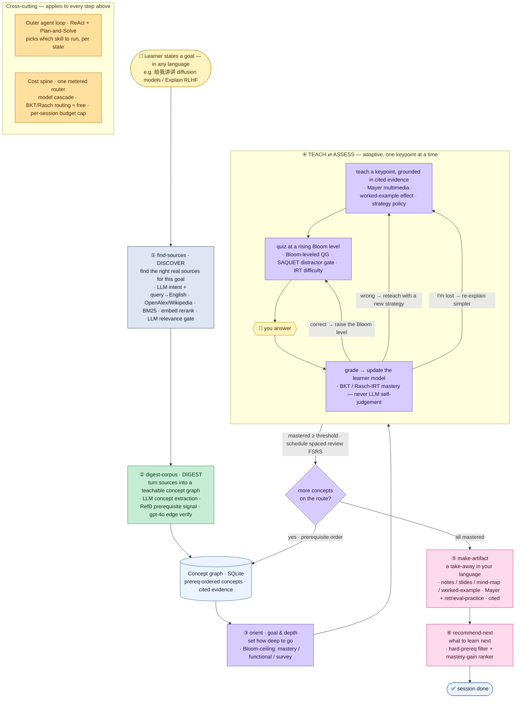

# Research & Architecture Spec

*The single reference for **why** LitNavigator is built the way it is and **what** its design is.*
For what is built today see [BACKEND-COMPLETE](BACKEND-COMPLETE.md) / [FRONTEND-COMPLETE](FRONTEND-COMPLETE.md);
for measured quality see [E2E-REPORT](E2E-REPORT.md).

---

## 1. The problem

You have a question about a research field. Today, **no single tool** will go and fetch the right
papers, turn them into a syllabus, and then *teach* it to you — adapting as you stumble.

| | Models you | Teach / test / reteach | Prereq order | From live literature | Finds its own sources |
|--|:--:|:--:|:--:|:--:|:--:|
| Elicit / SciSpace | ✗ | ✗ | ✗ | ✓ | ✓ |
| NotebookLM | ✗ | ✗ | ✗ | ✓ (you upload) | ✗ |
| Khanmigo / LearnLM | ✓ | ✓ | ✓ | ✗ | ✗ (human-authored) |
| **LitNavigator** | ✓ | ✓ | ✓ | ✓ | **✓ (discovered + digested live)** |

**LitNavigator is the open-world AI research tutor that fills that gap.** Give it any goal, in any
language; it finds real sources, builds a prerequisite-ordered concept map from them, teaches you
through it adaptively (grounded in cited evidence, never bluffing), produces take-away study material,
and tells you what to learn next — all under a strict, metered cost budget.

## 2. Research questions

1. **Discovery** — can an agent reliably find the *right* real sources for an arbitrary goal (and in
   any language), not just topically-adjacent ones?
2. **Digestion** — can it turn raw sources into a teachable concept graph with trustworthy
   *prerequisite* structure (the hardest signal to extract)?
3. **Teaching** — can it teach and assess adaptively while keeping an *honest* learner model (mastery
   from real answers, never the model grading itself)?
4. **Trust & cost** — can it stay grounded (no hallucinated facts/citations) and cheap (cents, not
   dollars) end-to-end?

## 3. Methods & evidence (what research each part is built on)

| Stage | Method (plain language) | Source |
|--|--|--|
| Discover — rank | Keyword pre-filter, then meaning-based re-rank of candidate sources | **BM25** (Robertson & Zaragoza); **SPECTER** scientific embeddings (Cohan et al. 2020) → we use `text-embedding-3-small` cosine |
| Discover — relevance | A cheap LLM scores each source's fit to the *specific* goal and drops adjacent-but-wrong ones | (our relevance gate) |
| Digest — prerequisites | A non-LLM "reference-distance" signal (does A's material point at B more than the reverse?) blended with an LLM judge | **RefD** — Liang et al., *Measuring Prerequisite Relations Among Concepts*, EMNLP 2015 |
| Digest — extraction | LLM extracts concepts + keypoints from source text (graph-style) | GraphRAG (Microsoft) |
| Teach — depth | Goal sets a Bloom's-taxonomy ceiling (survey / functional / mastery) | **Bloom's taxonomy** (Anderson & Krathwohl, revised) |
| Teach — explanation | Concise, evidence-grounded, worked examples; strategy varies by learner | **Mayer** (multimedia learning); **Sweller / Kalyuga** (cognitive load, worked-example & expertise-reversal) |
| Assess — questions | Bloom-leveled question generation; bad items rejected by a flaw gate | **BloomLLM** (EC-TEL 2024); **SAQUET** item-flaw gate (AIED 2024) |
| Assess — difficulty | A deliberately weaker LLM "student" attempts the item; harder if it fails | **SMART** (EMNLP 2025) student-simulation + IRT |
| Assess — mastery | Bayesian Knowledge Tracing / Rasch-IRT updated from real answers — **never LLM self-judgement** | **BKT** (Corbett & Anderson 1995); specialised-KT-beats-LLM (arXiv 2603.02830) |
| Assess — spacing | Spaced-repetition review schedule after mastery | **FSRS** |
| Artifact | Study notes / slides / map / worked example; the testing (retrieval-practice) effect | **Mayer**; **Roediger & Karpicke 2006** |
| Orchestration | The outer agent picks which skill to run per state | **ReAct** (Yao et al. 2022); **Plan-and-Solve** (Wang et al. 2023) |
| Cost | Cheap model by default, frontier only when needed; cheap pre-filters before paid calls | **FrugalGPT**; **RouteLLM** (ACL 2025) |
| Provider access | One gateway to any LLM provider (OpenAI / Anthropic / Gemini / DeepSeek / local) | **LiteLLM** unified API |

## 4. Architecture (the design)

The system is **five contracted "stage skills"** orchestrated by an outer agent loop, all sharing one
**concept graph** (SQLite) as the spine and one **metered router** for every model call.

### 4.1 The five stages
1. **find-sources (DISCOVER)** — `{goal, intent}` → real sources. Normalise the goal to an English
   search query → classify intent → query OpenAlex + Wikipedia → BM25 pre-filter → embedding re-rank +
   authority + dedup → **relevance gate** (drop off-topic) → fetch full text for the top few.
2. **digest-corpus (DIGEST)** — `{sources}` → concept graph. Extract concepts + keypoints → propose
   prerequisite & similarity edges (RefD + LLM) → a frontier model verifies the high-impact prereq
   edges → persist concepts, edges, keypoints, quiz seeds, and cited chunks.
3. **teach / assess (inner loop)** — the checkpointed LangGraph state machine: elicit goal depth
   (Bloom ceiling) → plan a prerequisite-ordered route → for each concept: teach keypoint-by-keypoint
   → quiz at rising Bloom levels → grade → reteach (if wrong) / re-explain (if "lost") / advance (if
   mastered) / honestly concede (if stuck) → next concept.
4. **make-artifact** — `{concepts, scenario}` → a take-away in the learner's language: mind-map /
   Cornell notes / slides / worked-example / combination, each with a retrieval prompt and resolving
   citations.
5. **recommend-next** — graph + mastery → ranked "what to learn next" (only concepts whose
   prerequisites are met, ranked by how much they unlock).

### 4.2 Cross-cutting
- **Cost spine** — one router is the single chokepoint for every LLM/embedding call: a tier registry
  (cheap / frontier / embed, with env-overridable models + rates), tier routing (cheap by default,
  frontier on demand), a per-session budget cap with an 80% alert, a result cache, and a
  strict-liveness mode that makes a real call provably distinct from a silent fallback. Every call is
  written to a cost ledger. The client routes through **LiteLLM**, so it is **provider-agnostic** —
  OpenAI, Anthropic, Gemini, DeepSeek, Groq, Bedrock, Azure, Ollama / any OpenAI-compatible server —
  configured by env, with `provider=none` fully offline ($0).
- **Honesty invariants** — mastery / confidence / routing are **rule-computed**, never emitted by the
  model; every taught claim and artifact is grounded in cited source chunks; prerequisite confidence
  is rule-computed and surfaced, never hallucinated.

### 4.3 Data model (SQLite)
`concepts` (slug, name, source, domain) · `concept_edges` (prerequisite / similarity, confidence,
evidence) · `keypoints` (objective, bloom level, evidence chunk) · `quiz_items` (answer key,
distractors, IRT difficulty) · `papers` + `paper_chunks` (the cited evidence) · `learner_state`
(mastery, confidence per concept per session) · `cost_ledger` · caches (`result_cache`,
`digest_cache`, `discover_results`).

## 5. Validation doctrine (live-first)

Open-world capability is meaningless if only tested offline, so **every capability has a live gate**
that runs against a real provider and asserts structure + grounding + real metered cost. Offline gates
are kept only for deterministic safety/maths (formulas, schema, budget cap, cache). A green offline run
is *not* evidence a capability works — the live gate and the [E2E-REPORT](E2E-REPORT.md) are.

## 6. Status & deferred

All five stages and the cost spine are implemented and live-verified (see
[BACKEND-COMPLETE](BACKEND-COMPLETE.md)). Still deferred: streaming a live cold-start to the screen,
multi-source digest for breadth, more source adapters (Semantic Scholar, YouTube transcripts), and
SPECTER re-ranking — all tracked in [BACKEND-ROADMAP](BACKEND-ROADMAP.md).
