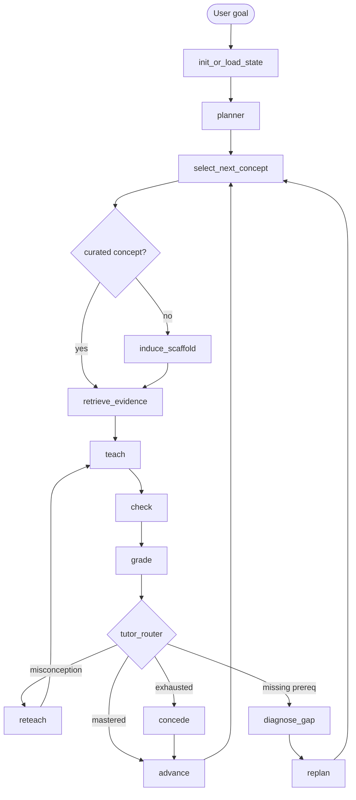

# Architecture

This document is the engineering architecture map for LitNavigator. The complete product rationale lives in `litnavigator-build-spec.md`; this file keeps the build-facing boundaries, state machine, and data flow small enough to implement against.

## Product Boundary

LitNavigator is a stateful tutor for entering an unfamiliar research subfield. It is not a general chat app, a literature search engine, or a paper summarizer.

The system must prove three things:

1. It models the learner per concept.
2. It changes the learning route based on learner state.
3. It can add literature-induced scaffolding with provenance and calibrated confidence.

Everything else is support.

## System Layers

```text
User goal
  -> session/state initialization
  -> concept graph and route planning
  -> evidence retrieval
  -> teaching/checking/grading loop
  -> routing decision
  -> route advance, reteach, replan, concede, or induction
  -> durable trace
```

### Interaction Layer

The UI can be thin. It must show:

- current concept,
- current route,
- mastery and confidence,
- decision rationale,
- cited evidence,
- curated vs induced provenance.

M0 can use CLI output. M1+ needs a recordable view.

### State-Machine Layer

The state machine owns flow control. M0 is a plain function pipeline; **M1 introduces the real LangGraph `StateGraph`** (these nodes as graph nodes, `tutor_router` as the conditional edge, `SqliteSaver` for NavState). The node boundaries are identical in both, so M0 ports cleanly into the graph:

- `init_or_load_state`
- `planner`
- `select_next_concept`
- `retrieve_evidence`
- `teach`
- `check`
- `grade`
- `tutor_router`
- `reteach`
- `diagnose_gap`
- `replan`
- `concede`
- `induce_scaffold`
- `advance`

### Domain State Layer

`NavState` is the runtime state contract. It carries:

- session identity,
- user goal,
- concept DAG,
- per-concept learner state,
- route,
- current evidence,
- quiz/check result,
- diagnosis,
- decision and rationale,
- history.

Durable domain tables mirror the parts of state needed for audit, demo, and acceptance checks.

### Retrieval Layer

Retrieval is tiered:

- M0: deterministic fixture lookup.
- M1: SQLite FTS5/BM25 plus precomputed concept-paper binding.
- M2: evidence-bound teaching and quiz items.
- M3: induction reads already-ingested chunks.
- M4: optional vector/hybrid retrieval.

No live paper fetch is required during the demo.

### Induction Layer

`induce_scaffold` never silently replaces curated structure. It writes new edges or misconceptions as `source='induced'`, with:

- evidence chunks,
- confidence,
- confidence basis,
- conflict flags when it disagrees with curated structure.

Induction runs over already-ingested chunks. **Currently:** with `LITNAV_LLM_PROVIDER=qwen` the LLM labels the evidence *strength* (with `none` the offline candidate's label is used); the induced edge/misconception **structure comes from the offline candidate either way**. `confidence` is always computed by the rule in `docs/data-contract.md` — never returned by the LLM. **Future work:** fully autonomous live induction (the LLM proposing the edge/misconception itself from extracted PDF text), which needs real PDF chunk extraction; until then the spec's "at least one live induction" rule is only partially met (strength labeling). See `docs/evaluation.md`.

## State Machine



## Decision Order

`tutor_router` applies this order:

1. If mastery is above threshold, `advance`.
2. If a misconception is detected, prerequisites are met, and reteach is not exhausted, `reteach`.
3. If prerequisites are not mastered, `diagnose_gap`.
4. If reteach is exhausted and prerequisites are met, `concede`.

Off-curriculum concepts are detected before the inner loop and routed through `induce_scaffold`.

## Data Flow

### M0 Flow

```text
seed JSON
  -> SQLite core tables
  -> init learner_state
  -> deterministic route
  -> fixed quiz
  -> BKT update
  -> decisions / quiz_attempts / route_steps
  -> verify_m0
```

### M1+ Flow

```text
offline corpus build
  -> papers / chunks / concept graph / quiz bank
  -> runtime session
  -> retrieval by current concept
  -> teach/check/grade
  -> route decision
  -> durable audit trace
```

### M3 Induction Flow

```text
off-skeleton concept
  -> retrieve candidate chunks
  -> extract prereq/misconception claims
  -> compute confidence from evidence rule
  -> write induced edge or misconception
  -> teach with provenance
```

## Engineering Boundaries

- Nodes should not embed raw SQL. Use storage helpers.
- Storage helpers should not decide routes.
- Retrieval should return chunks and scores, not teaching prose.
- Grading updates mastery and confidence, but does not choose the next node.
- The LLM client (`litnav/llm/`) returns structured fields only (misconception id, chunk selection, strength label); it never emits mastery, confidence, or a routing decision. Every LLM caller passes a deterministic fallback, so the system runs offline.
- UI (`litnav/ui/`) renders state and traces; it should not invent rationale.

## Intent / audience modes (M4)

The same engine re-scopes to the learner's *purpose*, not just their topic (e.g. a researcher entering the field vs a journalist prepping an interview). An intent maps onto existing `NavState` fields rather than a new subsystem:

- `target_concepts` breadth — full prerequisite chain vs a high-level orientation,
- `mastery_threshold` — "can build and critique" vs "can hold the conversation",
- `depth` — apply/explain vs recall,
- `frontier_flags` emphasis — surface consensus/contested/open as research opportunities vs talking points.

Free today (already parameters): the target set and the mastery threshold. Thin layer for M4: depth-aware teaching and frontier-prioritized routing. Intent selection is primarily a front-end scenario picker.

## Non-Goals Before M2

- Full paper ingestion pipeline.
- Production authentication.
- Multi-user memory.
- Polished graph visualization.
- Full vector retrieval.
- Fully automatic concept DAG construction.

Those can wait until the state machine and acceptance gates are stable.
